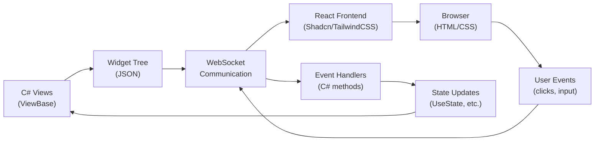

# How Ivy Works

<Ingress>
Ivy lets you build modern web UIs using pure C# on the server, combining the familiarity of React patterns with the power of C# and .NET.
</Ingress>

## Core Philosophy

Ivy is a **server-side web framework** that brings React-like patterns to C#. Instead of wrestling with JavaScript, HTML, and CSS, you write everything in C# using a reactive, component-based architecture.

## Architecture Overview



### 1. Views & Components

Every Ivy app is built from **Views** - C# classes that inherit from `ViewBase`. Each view implements a single `Build()` method that returns widgets or other views:

```csharp
[App(icon: Icons.Calendar)]
public class TodoApp : ViewBase
{
    public override object? Build()
    {
        var newTitle = UseState("");
        var todos = UseState(ImmutableArray.Create<Todo>());
        
        return new Card()
            .Title("My Todos")
            .Description("What needs to be done?")
            | Layout.Vertical(
                // Input and Add button
                Layout.Horizontal(
                    newTitle.ToTextInput(placeholder: "New task..."),
                    new Button("Add", onClick: _ => {
                        todos.Set(todos.Value.Add(new Todo(newTitle.Value, false)));
                        newTitle.Set("");
                    })
                ),
                // Todo list
                todos.Value.Select(todo => new TodoItem(todo))
            );
    }
}
```

### 2. Reactive State Management

Ivy provides React-inspired hooks for state management:

**Available Hooks:**

- `UseState<T>()` - Local component state that triggers re-renders
- `UseEffect()` - Side effects with dependency tracking  
- `UseService<T>()` - Dependency injection integration
- `UseSignal()`, `UseDownload()`, `UseWebhook()` - And many more...

```csharp
public override object? Build()
{
    // State hook - triggers re-render when changed
    var count = UseState(0);
    
    // Effect hook - runs when count changes
    UseEffect(() => {
        Console.WriteLine($"Count changed to: {count.Value}");
    }, count);
    
    return new Button($"Count: {count.Value}", 
        onClick: _ => count.Set(count.Value + 1));
}
```

### 3. Widget Library

Ivy ships with a comprehensive set of strongly-typed widgets:

| Category | Examples |
|----------|----------|
| Layouts | `Card`, `Layout.Vertical()`, `GridLayout`, `TabsLayout`, `SidebarLayout`... |
| Inputs | `TextInput`, `NumberInput`, `BoolInput`, `DateTimeInput`, `FileInput`... |
| Display | `Button`, `Badge`, `Progress`, `Table`, `Chart`, `Tooltip`... |
| Primitives | `Text`, `Icon`, `Image`, `Markdown`, `Json`, `Code`... |

### 4. Real-time Communication

The magic happens through WebSocket communication:

**Key Steps:**

1. **Initial Render**: Ivy builds your view tree and serializes it to JSON
2. **WebSocket Transfer**: The widget tree is sent to the browser
3. **React Frontend**: A pre-built React client renders the widgets as HTML
4. **Event Handling**: User interactions trigger events sent back to C#
5. **State Updates**: Ivy detects changes and re-renders only affected parts

<Callout Type="tip">
When working with search results in the sidebar (both in Ivy Samples and Docs), you can **Ctrl + right click** on any item to open it as a separate app in a new window. This is handy for multitasking or developing multiple features simultaneously.
</Callout>

## Development Experience

### Hot Reloading

The development workflow is incredibly smooth:

```terminal
>dotnet watch
```

That's it! Changes to your C# code instantly refresh the browser.

### Strongly Typed Everything

No more runtime errors from typos in HTML/CSS:

```csharp
// Compile-time safety
new Button("Click me")
    .Variant(ButtonVariant.Primary)
    .Icon(Icons.Plus)
    .Size(Size.Large);

// This won't compile
new Button().Variant("invalid-variant"); // Compiler error!
```

### Seamless .NET Integration

```csharp
public override object? Build()
{
    // Use any .NET library
    var db = UseService<MyDbContext>();
    var logger = UseService<ILogger<MyApp>>();
    
    // Async operations work naturally
    var data = await db.Users.ToListAsync();
    
    return new Table(data)
        .Columns(
            col => col.Name,
            col => col.Email,
            col => col.CreatedAt.ToString("yyyy-MM-dd")
        );
}
```

## Why This Approach Works

### For C# Developers

- Leverage existing C# skills and ecosystem
- Full IntelliSense and debugging support
- Type safety prevents runtime UI errors
- Seamless integration with existing .NET code

### For Teams

- Single language across the entire stack
- Shared models between frontend and backend
- Easier code reviews and maintenance
- Faster development cycles

### For Applications

- Real-time updates without complex JavaScript
- Built-in security (business logic stays on server)
- Easy deployment (single .NET project)

---

**Next:** Ready to build something? Check out the [Todo Tutorial](05_TodoTutorial.md) to see Ivy in action!
