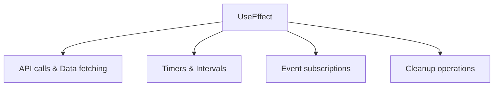

# Effects

<Ingress>
Perform side effects in your Ivy views with the UseEffect hook, similar to React's useEffect but optimized for server-side architecture.
</Ingress>

The `UseEffect` hook is a powerful feature in Ivy that allows you to perform side effects in your views. It's similar to React's useEffect hook but adapted for Ivy's architecture and patterns.

Effects are essential for handling operations that don't directly relate to rendering:



## Basic Usage

The simplest form of `UseEffect` runs after the component initializes:

```csharp demo-below
public class BasicEffectView : ViewBase
{
    public override object? Build()
    {
        var message = UseState("Loading...");
        
        // Effect runs once after component initializes
        UseEffect(async () =>
        {
            await Task.Delay(2000); // Simulate API call
            message.Set("Data loaded!");
        });
        
        return Text.P(message.Value);
    }
}
```

## Effect Overloads

Ivy provides four different overloads of `UseEffect` to handle various scenarios:

### 1. Action Handler

For simple synchronous operations:

```csharp
UseEffect(() =>
{
    Console.WriteLine("Component initialized");
});
```

### 2. Async Task Handler

For asynchronous operations:

```csharp
UseEffect(async () =>
{
    var data = await ApiService.GetData();
    // Handle data...
});
```

### 3. Disposable Handler

For operations that need cleanup:

```csharp
UseEffect(() =>
{
    var timer = new Timer(callback, null, 0, 1000);
    return timer; // Timer will be disposed when component unmounts
});
```

### 4. Async Disposable Handler

For async operations with cleanup:

```csharp
UseEffect(async () =>
{
    var connection = await ConnectToService();
    return connection; // Connection will be disposed automatically
});
```

## Effect Triggers

Effects can be triggered by different events using trigger parameters:

### State Dependencies

Effects can depend on state changes:

```csharp demo-below
public class DependentEffectView : ViewBase
{
    public override object? Build()
    {
        var count = UseState(0);
        var log = UseState<List<string>>(new List<string>());
        
        // Effect runs when count changes
        UseEffect(() =>
        {
            var currentLog = log.Value;
            var newLog = currentLog.ToList();
            newLog.Add($"Count changed to: {count.Value}");
            log.Set(newLog);
        }, count); // Dependency on count state
        
        return Layout.Vertical()
            | new Button($"Count: {count.Value}", 
                onClick: _ => count.Set(count.Value + 1))
            | Layout.Vertical(log.Value.Select(Text.Small));
    }
}
```

### Multiple Dependencies

Effects can depend on multiple state variables:

```csharp
UseEffect(() =>
{
    // Runs when either firstName or lastName changes
    var fullName = $"{firstName.Value} {lastName.Value}";
    // Handle full name...
}, firstName, lastName);
```

### Built-in Triggers

Ivy provides several built-in trigger types:

```csharp
// Run after component initialization (default)
UseEffect(() => { /* ... */ }, EffectTrigger.AfterInit());

// Run after each render
UseEffect(() => { /* ... */ }, EffectTrigger.AfterRender());

// Run when specific state changes
UseEffect(() => { /* ... */ }, EffectTrigger.AfterChange(myState));
```

## Effect Priorities

Effects are executed with different priorities to ensure proper ordering:

- **`EffectPriority.StateChange`** - Immediate effects after state changes
- **`EffectPriority.AfterRender`** - Effects after virtual DOM updates  
- **`EffectPriority.AfterInit`** - Effects during initialization

The priority is automatically determined based on the trigger type, but understanding this helps with debugging and performance optimization.

## Common Patterns

### Data Fetching

<Callout type="Info">
You do not need to manually catch exceptions in UseEffect. Ivy has a built-in exception handling pipeline that automatically catches exceptions from effects and displays them to users via error notifications and console logging. The system wraps effect exceptions in `EffectException` and routes them through registered exception handlers.
</Callout>

```csharp demo-below
public class DataFetchView : ViewBase
{
    public override object? Build()
    {
        var data = UseState<List<Item>?>(null);
        var loading = UseState(true);
        
        UseEffect(async () =>
        {
            loading.Set(true);
            
            // Simulate API call - exceptions automatically handled by Ivy
            await Task.Delay(1500);
            var items = new List<Item>
            {
                new("Item 1", "Description 1"),
                new("Item 2", "Description 2"),
                new("Item 3", "Description 3")
            };
            
            data.Set(items);
            loading.Set(false);
        });
        
        if (loading.Value)
            return Text.P("Loading data...");
            
        return Layout.Vertical(
            data.Value?.Select(item => 
                new Card(
                    Layout.Vertical()
                        | Text.H4(item.Name)
                        | Text.P(item.Description)
                )
            ) ?? Enumerable.Empty<Card>()
        );
    }
}

public record Item(string Name, string Description);
```

### Timer and Intervals

```csharp demo-below
public class ClockEffectView : ViewBase
{
    public override object? Build()
    {
        var time = UseState(DateTime.Now);
        var isRunning = UseState(true);
        
        UseEffect(() =>
        {
            if (!isRunning.Value) return System.Reactive.Disposables.Disposable.Empty;
            
            var timer = new Timer(_ => 
            {
                time.Set(DateTime.Now);
            }, null, TimeSpan.Zero, TimeSpan.FromSeconds(1));
            
            return timer; // Timer disposed when effect re-runs or component unmounts
        }, isRunning);
        
        return Layout.Vertical()
            | Text.H3($"Current Time: {time.Value:HH:mm:ss}")
            | new Button(isRunning.Value ? "Stop" : "Start", 
                onClick: _ => isRunning.Set(!isRunning.Value));
    }
}
```

### Cleanup Operations

```csharp
public class SubscriptionView : ViewBase
{
    public override object? Build()
    {
        var messages = UseState<List<string>>(new List<string>());
        
        UseEffect(() =>
        {
            // Subscribe to external service
            var subscription = MessageService.Subscribe(message =>
            {
                var currentMessages = messages.Value;
                var newMessages = currentMessages.ToList();
                newMessages.Add(message);
                messages.Set(newMessages);
            });
            
            // Return subscription for automatic cleanup
            return subscription;
        });
        
        return Layout.Vertical(
            messages.Value.Select(Text.P)
        );
    }
}
```

### Conditional Effects

```csharp
public class ConditionalEffectView : ViewBase
{
    public override object? Build()
    {
        var isEnabled = UseState(false);
        var data = UseState<string?>();
        
        UseEffect(async () =>
        {
            if (!isEnabled.Value)
            {
                data.Set((string)null);
                return;
            }
            
            // Only fetch when enabled
            var result = await FetchData();
            data.Set(result);
        }, isEnabled);
        
        return Layout.Vertical()
            | new Button($"Fetching: {(isEnabled.Value ? "ON" : "OFF")}", 
                onClick: _ => isEnabled.Set(!isEnabled.Value))
            | (data.Value != null ? Text.P(data.Value) : Text.Muted("No data"));
    }
    
    private async Task<string> FetchData()
    {
        await Task.Delay(1000);
        return $"Data fetched at {DateTime.Now:HH:mm:ss}";
    }
}
```

## Advanced Usage

### Observable Integration

Effects can work with `IObservable<T>` streams:

```csharp
public class ObservableEffectView : ViewBase
{
    public override object? Build()
    {
        var values = UseState<List<int>>(new List<int>());
        var observable = UseService<IObservable<int>>();
        
        UseEffect(() =>
        {
            // Subscribe to observable stream
            return observable.Subscribe(value =>
            {
                var currentValues = values.Value;
                var newValues = currentValues.ToList();
                newValues.Add(value);
                values.Set(newValues);
            });
        }, observable.ToTrigger());
        
        return Layout.Vertical(
            values.Value.Select(v => Text.P($"Value: {v}"))
        );
    }
}
```

### Debounced Effects

For handling rapid state changes:

```csharp demo-below
public class DebounceEffectView : ViewBase
{
    public override object? Build()
    {
        var searchTerm = UseState("");
        var results = UseState<List<string>>(new List<string>());
        var isSearching = UseState(false);
        
        // Immediate effect for UI feedback
        UseEffect(() =>
        {
            isSearching.Set(!string.IsNullOrEmpty(searchTerm.Value));
        }, searchTerm);
        
        // Debounced effect for actual search
        UseEffect(async () =>
        {
            if (string.IsNullOrEmpty(searchTerm.Value))
            {
                results.Set(new List<string>());
                return;
            }
            
            // Simulate search API call
            await Task.Delay(500);
            var searchResults = new List<string>
            {
                $"Result 1 for '{searchTerm.Value}'",
                $"Result 2 for '{searchTerm.Value}'",
                $"Result 3 for '{searchTerm.Value}'"
            };
            
            results.Set(searchResults);
            isSearching.Set(false);
        }, searchTerm.Throttle(TimeSpan.FromMilliseconds(500)).ToTrigger());
        
        return Layout.Vertical()
            | searchTerm.ToTextInput(placeholder: "Search...")
            | (isSearching.Value ? Text.Muted("Searching...") : null)
            | Layout.Vertical(results.Value.Select(Text.P));
    }
}
```

## Best Practices

### 1. Always Handle Cleanup

```csharp
// Good: Returns disposable for cleanup
UseEffect(() =>
{
    var timer = new Timer(callback, null, 0, 1000);
    return timer;
});

// Bad: No cleanup, potential memory leak
UseEffect(() =>
{
    var timer = new Timer(callback, null, 0, 1000);
    // Timer never disposed!
});
```

### 2. Use Appropriate Dependencies

```csharp
// Good: Specific dependencies
UseEffect(() =>
{
    ProcessData(data.Value, filter.Value);
}, data, filter);

// Bad: Missing dependencies
UseEffect(() =>
{
    ProcessData(data.Value, filter.Value); // filter not in dependencies!
}, data);

// Bad: Too many dependencies
UseEffect(() =>
{
    ProcessData(data.Value);
}, data, filter, sortOrder, pageSize); // Unnecessary dependencies
```

### 3. Let Ivy Handle Exceptions

```csharp
UseEffect(async () =>
{
    // No need for try-catch - Ivy automatically handles exceptions
    var result = await RiskyOperation();
    // Handle success...
});
```

### 4. Avoid Infinite Loops

```csharp
// Bad: Creates infinite loop
UseEffect(() =>
{
    count.Set(count.Value + 1); // This triggers the effect again!
}, count);

// Good: Conditional updates
UseEffect(() =>
{
    if (count.Value < 10)
    {
        count.Set(count.Value + 1);
    }
}, count);
```

### 5. Use Memoized Callbacks for Complex Dependencies

```csharp
public class ComplexEffectView : ViewBase
{
    public override object? Build()
    {
        var data = UseState<List<Item>>(new List<Item>());
        var filter = UseState("");
        
        // Memoize the processing function
        var processData = UseCallback(async () =>
        {
            var filtered = data.Value
                .Where(item => item.Name.Contains(filter.Value))
                .ToList();
            // Process filtered data...
        }, data, filter);
        
        // Use memoized callback in effect
        UseEffect(async () =>
        {
            await processData();
        }, processData);
        
        return /* UI */;
    }
}
```

## Performance Considerations

### Effect Execution Order

Effects are executed in priority order:

1. **StateChange** - Immediate effects after state updates
2. **AfterRender** - Effects after DOM updates
3. **AfterInit** - Initialization effects

### Memory Management

- Effects with disposable returns are automatically cleaned up
- Avoid capturing large objects in effect closures
- Use weak references for long-lived subscriptions when appropriate

### Debugging Effects

```csharp
UseEffect(() =>
{
    Console.WriteLine($"Effect triggered at {DateTime.Now}");
    // Your effect logic...
}, dependency);
```

## Common Pitfalls

### 1. Forgetting Dependencies

```csharp
// Wrong: Missing dependency
var multiplier = UseState(2);
UseEffect(() =>
{
    var result = count.Value * multiplier.Value; // Uses multiplier but not in deps
    // ...
}, count); // Missing multiplier dependency

// Correct: Include all dependencies
UseEffect(() =>
{
    var result = count.Value * multiplier.Value;
    // ...
}, count, multiplier);
```

### 2. Stale Closures

```csharp
// Wrong: Captures stale state
UseEffect(() =>
{
    var timer = new Timer(_ =>
    {
        // This captures the initial value of count!
        Console.WriteLine(count.Value);
    }, null, 1000, 1000);
    return timer;
}); // No dependencies - effect only runs once

// Correct: Update dependencies or use current values
UseEffect(() =>
{
    var timer = new Timer(_ =>
    {
        Console.WriteLine(count.Value); // Will see current value
    }, null, 1000, 1000);
    return timer;
}, count); // Re-create timer when count changes
```

### 3. Not Awaiting Async Operations

```csharp
// Wrong: Fire-and-forget async
UseEffect(() =>
{
    DoAsyncWork(); // No await - operation may not complete
});

// Correct: Proper async handling
UseEffect(async () =>
{
    await DoAsyncWork(); // Properly await the operation
});
```

## See Also

- [State Management](./State.md) - Managing component state
- [Memoization](./Memoization.md) - Optimizing performance with memoization
- [Signals](./Signals.md) - Reactive state management
- [Views](./Views.md) - Understanding Ivy views and components
