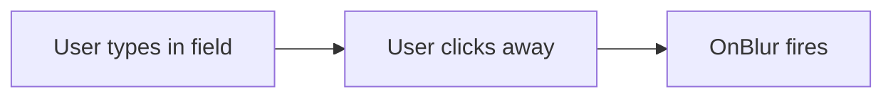

---
searchHints:
  - onblur
  - events
  - focus
  - blur
  - event-handlers
  - input-events
  - form-events
---

# Event Handlers

<Ingress>
Handle user interactions and input events in Ivy with event handlers like OnBlur, enabling validation, data persistence, and reactive user experiences.
</Ingress>

Event handlers allow you to respond to user interactions with widgets in your Ivy applications. They enable you to execute custom logic when users interact with UI elements, such as clicking buttons, changing input values, or moving focus between fields.

## Basic Usage

The simplest form of `OnBlur` handler performs an action when the input loses focus:

```csharp demo-tabs
public class BasicBlurExample : ViewBase
{
    public override object? Build()
    {
        var name = UseState("");
        var message = UseState("");
        
        return Layout.Vertical()
            | name.ToTextInput("Your Name")
                .Placeholder("Enter your name...")
                .HandleBlur(_ => message.Set($"Hello, {name.Value}!"))
            | Text.P(message.Value);
    }
}
```

## OnBlur Event Handler

The `OnBlur` event handler is triggered when an input widget loses focus. This is particularly useful for validation, auto-saving data, analytics tracking, or performing cleanup operations when a user finishes interacting with a field.

### When OnBlur Fires



### Available on Input Widgets

The `OnBlur` event handler is available on all input widgets that implement the `IAnyInput` interface:

| Input Widget | Description |
|--------------|-------------|
| `TextInput` | Text, password, email, search, and textarea inputs |
| `NumberInput` | Number and slider inputs |
| `SelectInput` | Dropdown select inputs |
| `AsyncSelectInput` | Async dropdown inputs with server-side data |
| `BoolInput` | Checkbox and switch inputs |
| `DateTimeInput` | Date and time picker inputs |
| `DateRangeInput` | Date range picker inputs |
| `FileInput` | File upload inputs |
| `ColorInput` | Color picker inputs |
| `CodeInput` | Code editor inputs |
| `FeedbackInput` | Star rating and feedback inputs |
| `ReadOnlyInput` | Read-only display inputs |

## Common Patterns

### Validation Pattern

Validate fields when the user finishes editing:

```csharp demo-tabs
public class ValidationBlurExample : ViewBase
{
    public override object? Build()
    {
        var email = UseState("");
        var error = UseState(() => (string?)null);
        
        return email.ToTextInput()
            .Placeholder("your.email@example.com")
            .HandleBlur(() => 
            {
                error.Set(string.IsNullOrWhiteSpace(email.Value) ? "Required" 
                    : !email.Value.Contains("@") ? "Invalid email" 
                    : null);
            })
            .Invalid(error.Value);
    }
}
```

### Auto-Save & Formatting Pattern

Perform actions like saving or formatting when focus is lost:

```csharp demo-tabs
public class AutoSaveFormatExample : ViewBase
{
    public override object? Build()
    {
        var phoneNumber = UseState("");
        var title = UseState("");
        var lastSaved = UseState(() => (DateTime?)null);
        var client = UseService<IClientProvider>();
        
        return Layout.Vertical()
            // Auto-save pattern
            | title.ToTextInput()
                .Placeholder("Document title")
                .HandleBlur(async () => 
                {
                    await Task.Delay(500); // Save to database
                    lastSaved.Set(DateTime.Now);
                    client.Toast("Saved!");
                })
            | Text.Muted(lastSaved.Value != null ? $"Saved at {lastSaved.Value:HH:mm:ss}" : "")
            
            // Format pattern
            | phoneNumber.ToTextInput()
                .Placeholder("Enter 10-digit phone")
                .HandleBlur(() => 
                {
                    var digits = new string(phoneNumber.Value.Where(char.IsDigit).ToArray());
                    if (digits.Length == 10)
                        phoneNumber.Set($"({digits.Substring(0, 3)}) {digits.Substring(3, 3)}-{digits.Substring(6, 4)}");
                });
    }
}
```

### Async Operations Pattern

Handle async operations like API validation:

```csharp demo-tabs
public class AsyncBlurExample : ViewBase
{
    public override object? Build()
    {
        var username = UseState("");
        var message = UseState("");
        
        return Layout.Vertical()
            | username.ToTextInput()
                .Placeholder("Choose username")
                .HandleBlur(async () =>
                {
                    if (string.IsNullOrWhiteSpace(username.Value)) return;
                    
                    message.Set("Checking...");
                    await Task.Delay(1000); // API call
                    
                    var isAvailable = !username.Value.Equals("admin", StringComparison.OrdinalIgnoreCase);
                    message.Set(isAvailable ? "Available" : "Taken");
                })
            | Text.P(message.Value);
    }
}
```

## HandleBlur Method Signatures

```csharp
// Simple action (most common)
input.HandleBlur(() => Validate());

// With event parameter
input.HandleBlur((Event<IAnyInput> e) => Log(e.Id));

// Async operation
input.HandleBlur(async () => await SaveToApi());
```

## See Also

- [Forms](./Forms.md) - Building forms with validation
- [State](./State.md) - Managing component state
- [Effects](./Effects.md) - Performing side effects
- [Widgets](./Widgets.md) - Understanding Ivy widgets
