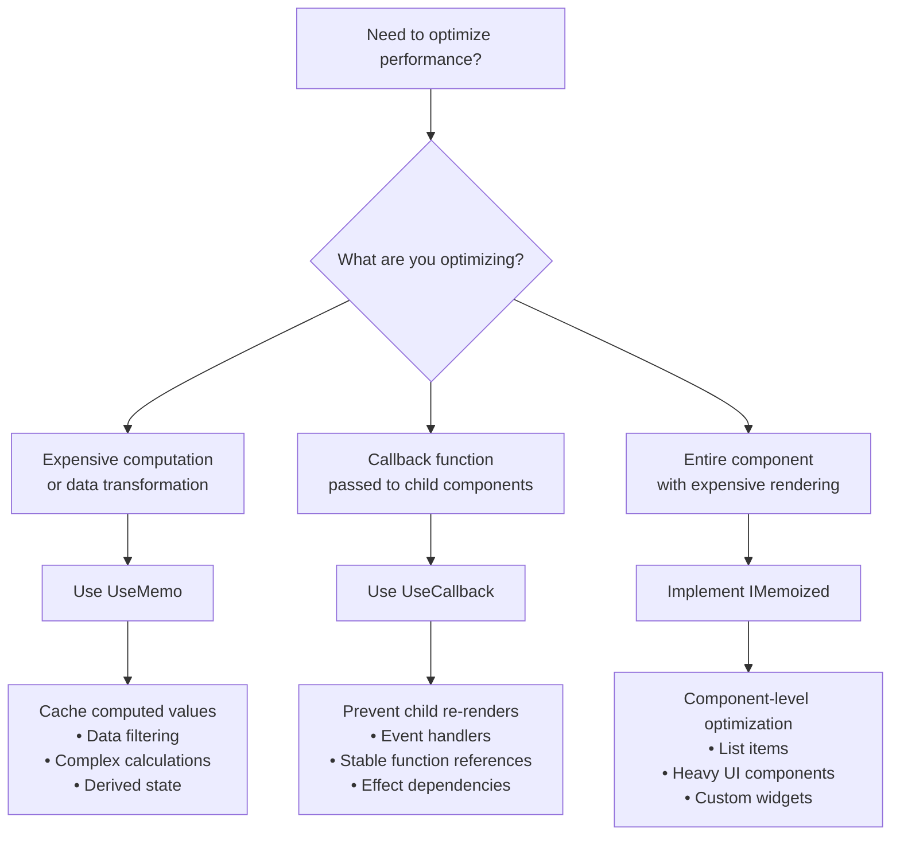
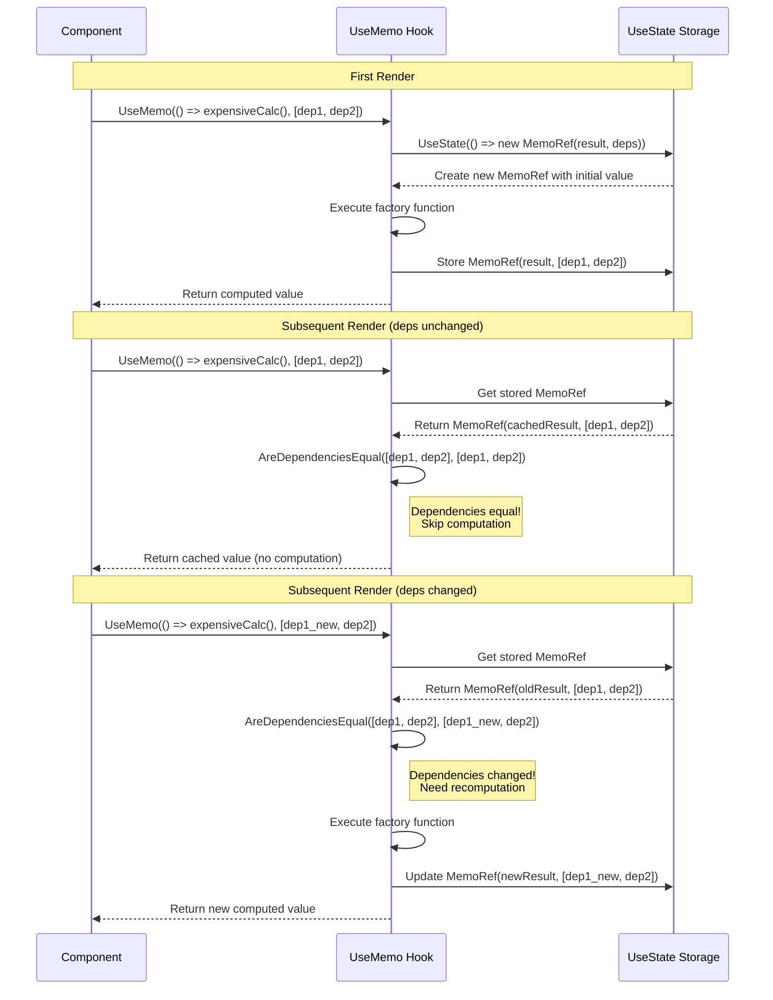
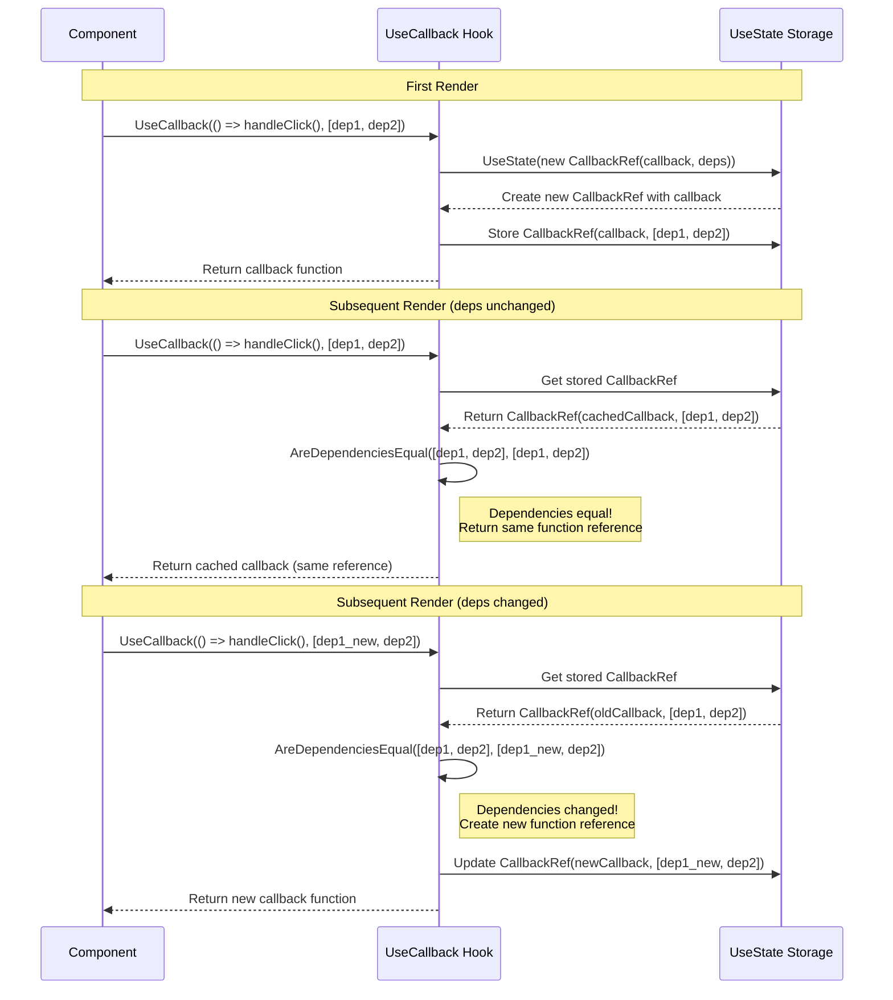
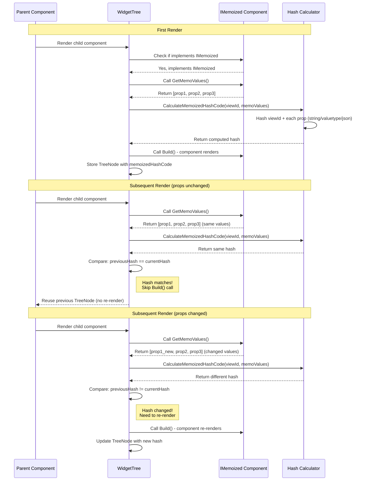
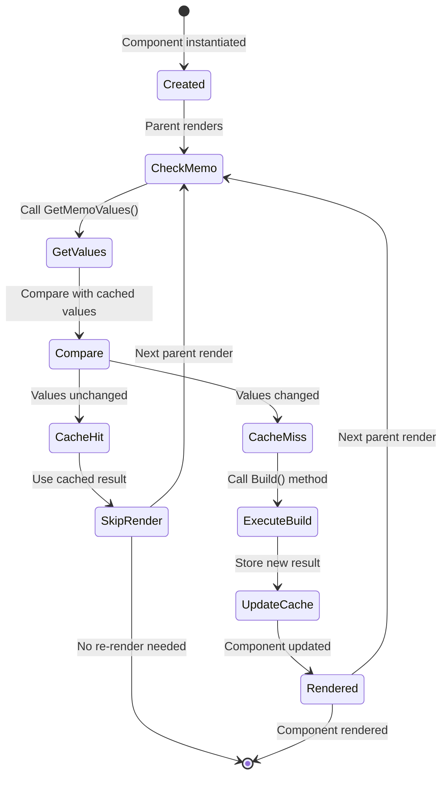
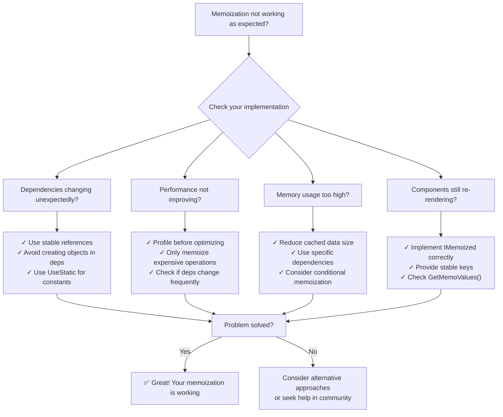

---
searchHints:
  - performance
  - optimization
  - caching
  - usememo
  - usecallback
  - rendering
---

# Memoization

<Ingress>
Memoization helps Ivy applications run faster by caching results of expensive computations and preventing unnecessary re-renders.
</Ingress>

## Overview

Memoization in Ivy provides several powerful tools to optimize performance:

- **`UseMemo`** - Caches the result of expensive computations
- **`UseCallback`** - Memoizes callback functions to prevent unnecessary re-renders
- **`IMemoized`** - Interface for component-level memoization

These hooks work similarly to their React counterparts (`useMemo`, `useCallback`) but are designed specifically for Ivy's architecture.

## Choosing the Right Memoization Approach



## UseMemo Hook

The `UseMemo` hook caches the result of a computation and only recomputes it when its dependencies change.

<Callout type="Tip">
`UseMemo` hook stores only the most recent dependency values for comparison; older values are discarded.
</Callout>

### How UseMemo Works



### Basic Usage

```csharp
public class ExpensiveCalculationView : ViewBase
{
    public override object? Build()
    {
        var input = UseState(0);
        
        // Memoize the result of an expensive calculation
        var result = UseMemo(() => 
        {
            // Simulate expensive calculation
            Thread.Sleep(1000);
            return input.Value * input.Value;
        }, input.Value); // Only recompute when input changes
        
        return Layout.Vertical(
            Text.Inline("Number", value: input.Value, onChange: v => input.Set(v)),
            Text.Inline($"Result: {result}")
        );
    }
}
```

### When to Use Memoization

Use memoization when:

- You have expensive computations that don't need to be redone on every render
- You want to prevent unnecessary re-renders of child components
- You're dealing with complex data transformations

### Best Practices

- **Dependency Array**: Always specify the dependencies that should trigger a recomputation
- **Expensive Operations**: Only memoize truly expensive operations
- **Clean Dependencies**: Keep the dependency array minimal and focused
- **Avoid Side Effects**: Memoized functions should be pure and not have side effects

### Examples

#### Complex Data Filtering

```csharp
public class DataFilterView : ViewBase
{
    public override object? Build()
    {
        var data = UseState(new List<Item>());
        var filter = UseState("");
        
        // Memoize filtered results
        var filteredData = UseMemo(() => 
            data.Value.Where(item => 
                item.Name.Contains(filter.Value, StringComparison.OrdinalIgnoreCase)
            ).ToList(),
            data, filter
        );
        
        return Layout.Vertical(
            new TextInput("Filter", value: filter.Value, onChange: v => filter.Set(v)),
            new Table(filteredData)
        );
    }
}
```

#### Computed Properties

```csharp
public class DashboardView : ViewBase
{
    public override object? Build()
    {
        var sales = UseState(new List<Sale>());
        
        // Memoize computed statistics
        var stats = UseMemo(() => new
        {
            Total = sales.Value.Sum(s => s.Amount),
            Average = sales.Value.Average(s => s.Amount),
            Count = sales.Value.Count
        }, sales);
        
        return Layout.Vertical(
            Text.Inline($"Total Sales: ${stats.Total:N2}"),
            Text.Inline($"Average Sale: ${stats.Average:N2}"),
            Text.Inline($"Number of Sales: {stats.Count}")
        );
    }
}
```

## UseCallback Hook

The `UseCallback` hook memoizes callback functions, preventing unnecessary re-renders when the callback is passed as a prop to child components.

<Callout type="Tip">
`UseCallback` memoizes the function reference itself, while `UseMemo` memoizes the result of calling a function. The memoized callback is only executed when you invoke it.
</Callout>

### How UseCallback Works



### Basic UseCallback Usage

```csharp
public class ParentView : ViewBase
{
    public override object? Build()
    {
        var count = UseState(0);
        var multiplier = UseState(2);
        
        // Memoize the callback to prevent child re-renders
        var handleIncrement = UseCallback(() => 
        {
            count.Set(count.Value + 1);
        }, count); // Only recreate when count changes
        
        var handleReset = UseCallback(() => 
        {
            count.Set(0);
        }); // No dependencies - callback never changes
        
        return Layout.Vertical(
            Text.Inline($"Count: {count.Value}"),
            new ChildComponent(handleIncrement, handleReset),
            new NumberInput("Multiplier", multiplier.Value, v => multiplier.Set(v))
        );
    }
}
```

### When to Use UseCallback

Use `UseCallback` when:

- **Passing callbacks to child components** - Prevents unnecessary re-renders
- **Callbacks are dependencies of other hooks** - Ensures stable references
- **Event handlers with expensive setup** - Avoids recreating handlers on every render

### UseCallback Examples

#### Preventing Child Re-renders

```csharp
public class TodoListView : ViewBase
{
    public override object? Build()
    {
        var todos = UseState(new List<Todo>());
        var filter = UseState("");
        
        // Memoize callbacks to prevent TodoItem re-renders
        var handleToggle = UseCallback((int id) => 
        {
            todos.Set(todos.Value.Select(t => 
                t.Id == id ? t with { Completed = !t.Completed } : t
            ).ToList());
        }, todos);
        
        var handleDelete = UseCallback((int id) => 
        {
            todos.Set(todos.Value.Where(t => t.Id != id).ToList());
        }, todos);
        
        var filteredTodos = UseMemo(() => 
            todos.Value.Where(t => 
                t.Title.Contains(filter.Value, StringComparison.OrdinalIgnoreCase)
            ).ToList(),
            todos, filter
        );
        
        return Layout.Vertical(
            new TextInput("Filter", filter.Value, v => filter.Set(v)),
            Layout.Vertical(
                filteredTodos.Select(todo => 
                    new TodoItem(todo, handleToggle, handleDelete).Key(todo.Id)
                )
            )
        );
    }
}
```

#### Stable Dependencies for Effects

```csharp
public class DataFetcherView : ViewBase
{
    public override object? Build()
    {
        var data = UseState<List<Item>?>(null);
        var loading = UseState(false);
        var searchTerm = UseState("");
        
        // Memoize the fetch function
        var fetchData = UseCallback(async () => 
        {
            loading.Set(true);
            try
            {
                var result = await ApiService.SearchItems(searchTerm.Value);
                data.Set(result);
            }
            finally
            {
                loading.Set(false);
            }
        }, searchTerm);
        
        // Use the memoized callback in an effect
        UseEffect(async () => 
        {
            await fetchData();
        }, fetchData); // Stable dependency prevents infinite loops
        
        return Layout.Vertical(
            new TextInput("Search", searchTerm.Value, v => searchTerm.Set(v)),
            loading.Value ? new Loading() : new ItemList(data.Value ?? new List<Item>())
        );
    }
}
```

## Component Memoization with IMemoized

The `IMemoized` interface allows entire components to be memoized, preventing re-renders when their props haven't changed.

### How IMemoized Works



### Basic Implementation

```csharp
public class ExpensiveComponent : ViewBase, IMemoized
{
    private readonly string _title;
    private readonly int _value;
    private readonly DateTime _timestamp;
    
    public ExpensiveComponent(string title, int value, DateTime timestamp)
    {
        _title = title;
        _value = value;
        _timestamp = timestamp;
    }
    
    // Define which values should trigger a re-render
    public object[] GetMemoValues()
    {
        return [_title, _value]; // Exclude _timestamp from memoization
    }
    
    public override object? Build()
    {
        // Expensive rendering logic here
        Thread.Sleep(100); // Simulate expensive operation
        
        return Layout.Vertical(
            Text.Heading(_title),
            Text.Block($"Value: {_value}"),
            Text.Small($"Rendered at: {DateTime.Now}")
        );
    }
}
```

### Real-World Example: List Items

```csharp
public class ProductListView : ViewBase
{
    public override object? Build()
    {
        var products = UseState(GetProducts());
        var sortBy = UseState("name");
        
        var sortedProducts = UseMemo(() => 
            products.Value.OrderBy(p => sortBy.Value switch
            {
                "name" => p.Name,
                "price" => p.Price.ToString(),
                _ => p.Id.ToString()
            }).ToList(),
            products, sortBy
        );
        
        return Layout.Vertical(
            new Select("Sort by", sortBy.Value, 
                new[] { "name", "price", "id" }, 
                v => sortBy.Set(v)
            ),
            Layout.Vertical(
                sortedProducts.Select((product, index) => 
                    new ProductItem(product, index).Key(product.Id)
                )
            )
        );
    }
}

public class ProductItem : ViewBase, IMemoized
{
    private readonly Product _product;
    private readonly int _index;
    
    public ProductItem(Product product, int index)
    {
        _product = product;
        _index = index;
    }
    
    public object[] GetMemoValues()
    {
        // Only re-render if product data or position changes
        return [_product.Id, _product.Name, _product.Price, _index];
    }
    
    public override object? Build()
    {
        // This component will only re-render when memoized values change
        return new Card(
            Layout.Horizontal(
                new Avatar(_product.ImageUrl),
                Layout.Vertical(
                    Text.Heading(_product.Name),
                    Text.Block($"${_product.Price:N2}"),
                    Text.Small($"Position: {_index + 1}")
                )
            )
        );
    }
}
```

### IMemoized Component Lifecycle



### Best Practices for IMemoized

- **Include all relevant props** - Any value that affects rendering should be in `GetMemoValues()`
- **Exclude volatile values** - Don't include timestamps or random values unless they affect the UI
- **Use with .Key()** - Always provide a stable key when rendering memoized components in lists
- **Keep it simple** - Only memoize components with expensive rendering logic

## Performance Considerations

### Memory vs Speed Trade-offs

- **Memory Usage**: Memoization caches values in memory. Consider the size of cached data:

- **Cache Invalidation**: If dependencies change too often or are unstable, cached results will be invalidated frequently, reducing the effectiveness of memoization. Ensure dependencies are stable and don't change unnecessarily:

- **Dependency Granularity**: Use specific dependencies rather than entire objects:

```csharp
// Good: Small computed value
var total = UseMemo(() => items.Value.Sum(x => x.Price), items);

// Caution: Large object that might consume significant memory
var processedData = UseMemo(() => 
    items.Value.Select(ProcessLargeItem).ToList(), items);
```

```csharp
// Bad: Object created on every render
var config = new { threshold: 100 };
var filtered = UseMemo(() => FilterItems(items.Value, config), items, config);

// Good: Stable dependency
var threshold = UseState(100);
var filtered = UseMemo(() => 
    FilterItems(items.Value, threshold.Value), items, threshold);
```

```csharp
// Less efficient: Depends on entire user object
var greeting = UseMemo(() => $"Hello, {user.Value.Name}!", user);

// More efficient: Depends only on the name
var userName = user.Value.Name;
var greeting = UseMemo(() => $"Hello, {userName}!", userName);
```

### When NOT to Memoize

- **Simple computations**: Don't memoize trivial operations
- **Frequently changing dependencies**: If dependencies change often, memoization provides no benefit
- **Small component trees**: In simple UIs, the overhead might outweigh benefits

```csharp
// Unnecessary memoization
var doubled = UseMemo(() => count.Value * 2, count);

// Just compute directly
var doubled = count.Value * 2;
```

## Common Pitfalls and Solutions

### Memoization Troubleshooting Guide



### 1. Unstable Dependencies

**Problem**: Creating new objects or arrays in the dependency array

```csharp
// Bad: New array created on every render
var result = UseMemo(() => ProcessData(data.Value), data.Value, new[] { "option1", "option2" });
```

**Solution**: Use stable references

```csharp
// Good: Stable dependency
var options = UseStatic(new[] { "option1", "option2" });
var result = UseMemo(() => ProcessData(data.Value), data.Value, options);
```

### 2. Missing Dependencies

**Problem**: Not including all values used in the memoized function

```csharp
// Bad: Missing 'multiplier' dependency
var result = UseMemo(() => items.Value.Sum(x => x.Price * multiplier.Value), items);
```

**Solution**: Include all dependencies

```csharp
// Good: All dependencies included
var result = UseMemo(() => items.Value.Sum(x => x.Price * multiplier.Value), items, multiplier);
```

### 3. Over-Memoization

**Problem**: Memoizing everything without considering the cost

```csharp
// Bad: Unnecessary memoization of simple operations
var isEven = UseMemo(() => count.Value % 2 == 0, count);
var doubled = UseMemo(() => count.Value * 2, count);
var greeting = UseMemo(() => $"Hello {name.Value}", name);
```

**Solution**: Only memoize expensive operations

```csharp
// Good: Direct computation for simple operations
var isEven = count.Value % 2 == 0;
var doubled = count.Value * 2;
var greeting = $"Hello {name.Value}";

// Memoize only when necessary
var expensiveResult = UseMemo(() => 
    items.Value.Where(x => x.IsActive)
             .GroupBy(x => x.Category)
             .ToDictionary(g => g.Key, g => g.ToList()), 
    items);
```

### 4. Incorrect IMemoized Implementation

**Problem**: Including volatile values in `GetMemoValues()`

```csharp
// Bad: Including timestamp that changes on every render
public object[] GetMemoValues()
{
    return [_id, _name, DateTime.Now]; // DateTime.Now always changes!
}
```

**Solution**: Only include values that affect the UI

```csharp
// Good: Only include relevant, stable values
public object[] GetMemoValues()
{
    return [_id, _name, _isActive]; // Only UI-affecting properties
}
```

### 5. Callback Dependencies Issues

**Problem**: Callbacks that capture too many variables

```csharp
// Bad: Callback recreated whenever any state changes
var handleClick = UseCallback(() => 
{
    DoSomething(data.Value, filter.Value, sortOrder.Value);
}, data, filter, sortOrder); // Too many dependencies
```

**Solution**: Split into smaller, focused callbacks

```csharp
// Good: Separate callbacks with minimal dependencies
var handleDataAction = UseCallback(() => DoSomethingWithData(data.Value), data);
var handleFilterAction = UseCallback(() => ApplyFilter(filter.Value), filter);
```

### 6. Forgetting Keys in Lists

**Problem**: Not providing stable keys for memoized list items

```csharp
// Bad: No keys, memoization won't work properly
return Layout.Vertical(
    items.Value.Select(item => new ItemComponent(item)) // Missing .Key()
);
```

**Solution**: Always provide stable keys

```csharp
// Good: Stable keys enable proper memoization
return Layout.Vertical(
    items.Value.Select(item => new ItemComponent(item).Key(item.Id))
);
```

## See Also

- [State Management](./State.md)
- [Effects](./Effects.md)
- [Signals](./Signals.md)
