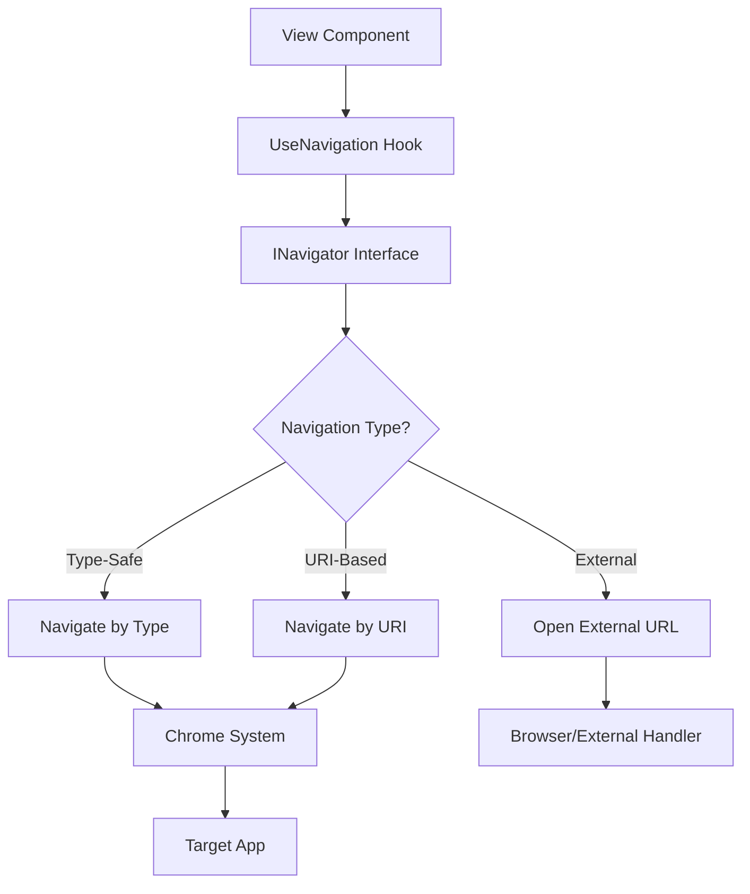

---
searchHints:
  - navigation
  - routing
  - usenavigation
  - navigate
  - apps
  - deeplink
  - urls
  - chrome
---

# Navigation

<Ingress>
The UseNavigation hook provides a powerful way to navigate between apps and external URLs in Ivy applications, enabling seamless user experiences and deep linking capabilities.
</Ingress>

## Overview

Navigation in Ivy is handled through the `UseNavigation()` hook, which returns an `INavigator` interface. This hook enables:

- **App-to-App Navigation** - Navigate between different Ivy apps within your application
- **External URL Navigation** - Open external websites and resources
- **Deep Linking** - Navigate to specific apps with parameters and arguments
- **Type-Safe Navigation** - Navigate using strongly-typed app classes

The navigation system is built on top of Ivy's signal system and integrates seamlessly with the Chrome framework for managing app lifecycle and routing.

## How UseNavigation Works



## Basic Usage

### Getting the Navigator

```csharp
[App(icon: Icons.Navigation)]
public class MyNavigationApp : ViewBase
{
    public override object? Build()
    {
        // Get the navigator instance
        var navigator = this.UseNavigation();
        
        return new Button("Navigate to Another App")
            .HandleClick(() => navigator.Navigate(typeof(AnotherApp)));
    }
}
```

### Navigation Methods

The `INavigator` interface provides two main navigation methods:

```csharp
public interface INavigator
{
    // Navigate using app type (type-safe)
    void Navigate(Type type, object? appArgs = null);
    
    // Navigate using URI string (flexible)
    void Navigate(string uri, object? appArgs = null);
}
```

## Navigation Patterns

### Type-Safe Navigation

Navigate to apps using their class types for compile-time safety:

```csharp
public class DashboardApp : ViewBase
{
    public override object? Build()
    {
        var navigator = this.UseNavigation();
        
        return Layout.Vertical(
            new Button("Go to User Profile")
                .HandleClick(() => navigator.Navigate(typeof(UserProfileApp))),
                
            new Button("Open Settings")
                .HandleClick(() => navigator.Navigate(typeof(SettingsApp))),
                
            new Button("View Reports")
                .HandleClick(() => navigator.Navigate(typeof(ReportsApp)))
        );
    }
}
```

### Navigation with Arguments

Pass data to target apps using strongly-typed arguments:

```csharp
public record UserProfileArgs(int UserId, string Tab = "overview");

// Navigate with arguments
navigator.Navigate(typeof(UserProfileApp), new UserProfileArgs(123, "details"));

// Receive arguments in target app
public class UserProfileApp : ViewBase
{
    public override object? Build()
    {
        var args = UseArgs<UserProfileArgs>();
        return Text.Heading($"User Profile: {args?.UserId}");
    }
}
```

### URI-Based Navigation

Use URI strings for dynamic navigation scenarios:

```csharp
// Navigate using URI strings
navigator.Navigate("app://dashboard");
navigator.Navigate("app://users");
navigator.Navigate("app://settings");

// Dynamic navigation
var appUri = $"app://{selectedAppName}";
navigator.Navigate(appUri);
```

### External URL Navigation

Open external websites and resources:

```csharp
// Open external URLs
navigator.Navigate("https://docs.ivy-framework.com");
navigator.Navigate("https://github.com/ivy-framework/ivy");
navigator.Navigate("mailto:support@example.com");
```


## Navigation Helpers

Create reusable navigation patterns:

```csharp
public static class NavigationHelpers
{
    public static Action<string> UseLinks(this IView view)
    {
        var navigator = view.UseNavigation();
        return uri => navigator.Navigate(uri);
    }
    
    public static Action UseBackNavigation(this IView view, string defaultApp = "app://dashboard")
    {
        var navigator = view.UseNavigation();
        return () => navigator.Navigate(defaultApp);
    }
}

// Usage
var navigateToLink = this.UseLinks();
var goBack = this.UseBackNavigation();
```

### Integration with Chrome Settings

Navigation behavior can be configured through Chrome settings:

```csharp
public class Program
{
    public static void Main(string[] args)
    {
        IvyApp.Run(args, app =>
        {
            app.UseChrome(ChromeSettings.Default()
                .UseTabs(preventDuplicates: true) // Prevent duplicate tabs
                .DefaultApp<DashboardApp>()       // Set default app
            );
        });
    }
}
```

### Navigation Modes

- **Tabs Mode**: Each navigation creates a new tab (default)
- **Pages Mode**: Navigation replaces the current view
- **Prevent Duplicates**: Avoid opening multiple tabs for the same app

## Best Practices and Common Patterns

### Type-Safe Navigation

Prefer type-safe navigation over URI strings when possible:

```csharp
// Preferred: Type-safe navigation
navigator.Navigate(typeof(UserProfileApp), new UserProfileArgs(userId));

// Avoid: String-based navigation when type is known
navigator.Navigate($"app://user-profile?userId={userId}");
```

### Master-Detail Navigation

Navigate from list views to detail views:

```csharp
return new Table<Item>(items)
    .Column("Name", i => i.Name)
    .OnRowClick(item => 
        navigator.Navigate(typeof(ItemDetailApp), new ItemDetailArgs(item.Id))
    );
```

### Conditional Navigation

Navigate based on user permissions or state:

```csharp
var handleNavigation = UseCallback(() =>
{
    if (user.HasRole("Admin"))
        navigator.Navigate(typeof(AdminPanelApp));
    else
        navigator.Navigate(typeof(UnauthorizedApp));
}, user);
```

### Memoized Navigation Callbacks

Use `UseCallback` to prevent unnecessary re-renders:

```csharp
var navigateToUser = UseCallback((int userId) =>
{
    navigator.Navigate(typeof(UserProfileApp), new UserProfileArgs(userId));
}, navigator);
```

## Troubleshooting

### App Not Found Error

Ensure your app has the `[App]` attribute:

```csharp
[App(icon: Icons.Dashboard)]
public class MyApp : ViewBase { }
```

### Navigation Arguments Not Received

Ensure argument types match exactly between source and target apps:

```csharp
// Source: navigator.Navigate(typeof(TargetApp), new MyArgs("value"));
// Target: var args = UseArgs<MyArgs>(); // Same type
```

### External URLs Not Opening

Include the protocol in external URLs:

```csharp
navigator.Navigate("https://example.com"); // Correct
navigator.Navigate("example.com"); // Incorrect - treated as app URI
```

## Performance Considerations

- **Memoize Navigation Callbacks**: Use `UseCallback` for navigation handlers to prevent unnecessary re-renders
- **Lazy App Loading**: Apps are loaded on-demand when navigated to
- **State Cleanup**: Navigation automatically handles cleanup of previous app state
- **Memory Management**: The Chrome system manages app lifecycle and memory usage

## See Also

- [Chrome Settings](./Program.md)
- [App Arguments](./Views.md)
- [Signals](./Signals.md)
- [State Management](./State.md)
