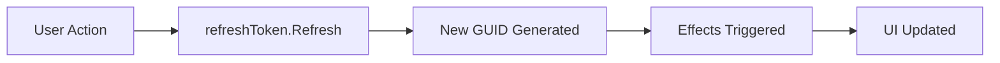

---
searchHints:
  - userefreshtoken
  - refresh
  - reload
  - trigger
  - manual-update
  - reactive
---

# Refresh Tokens

<Ingress>
Refresh tokens provide a mechanism to manually trigger UI updates and effect executions in Ivy, enabling you to reload data, refresh components, or trigger actions on demand.
</Ingress>

## Basic Usage

The `UseRefreshToken` hook creates a token that can be manually refreshed to trigger effects:

```csharp demo-below
public class BasicRefreshExample : ViewBase
{
    public override object? Build()
    {
        var refreshToken = this.UseRefreshToken();
        var timestamp = UseState(DateTime.Now);
        
        // Effect runs when refresh token changes
        UseEffect(() =>
        {
            timestamp.Set(DateTime.Now);
        }, [refreshToken]);
        
        return Layout.Vertical()
            | Text.Muted("Click the button to manually trigger a refresh")
            | new Button("Refresh", onClick: _ => refreshToken.Refresh())
            | Text.P($"Last refreshed: {timestamp.Value:HH:mm:ss.fff}");
    }
}
```

## Use Refresh Tokens

Refresh tokens are useful when you need to:

- Trigger effects after async operations complete
- Pass data from background operations to trigger UI updates
- Coordinate updates across different parts of your view
- Refresh external content like iframes



## Passing Return Values

Refresh tokens can carry return values to pass data between operations:

```csharp demo-below
public class ReturnValueExample : ViewBase
{
    public override object? Build()
    {
        var refreshToken = this.UseRefreshToken();
        var selectedColor = UseState("No color selected");
        
        UseEffect(() =>
        {
            if (refreshToken.IsRefreshed && refreshToken.ReturnValue is string color)
            {
                selectedColor.Set($"Selected: {color}");
            }
        }, [refreshToken]);
        
        return Layout.Vertical()
            | Layout.Horizontal(
                new Button("Red", onClick: _ => refreshToken.Refresh("Red")),
                new Button("Green", onClick: _ => refreshToken.Refresh("Green")),
                new Button("Blue", onClick: _ => refreshToken.Refresh("Blue")))
            | Text.P(selectedColor.Value);
    }
}
```

Return values can be any type, including complex objects like records or classes.

## Token Properties

| Property | Type | Description |
|----------|------|-------------|
| `Token` | `Guid` | A unique identifier that changes with each refresh |
| `IsRefreshed` | `bool` | `true` if the token has been refreshed at least once |
| `ReturnValue` | `object?` | The value passed to the last `Refresh()` call |

## Best Practices

### Use Return Values for Data Flow

```csharp
// Good: Pass important data through return values
refreshToken.Refresh(newProductId);

UseEffect(() =>
{
    if (refreshToken.ReturnValue is Guid productId)
    {
        // Load the new product
    }
}, [refreshToken]);
```

### Combine with AfterInit Trigger

```csharp
// Load data on init AND when manually refreshed
UseEffect(async () =>
{
    var data = await LoadData();
    // ...
}, [EffectTrigger.AfterInit(), refreshToken]);
```

### Guard Against Unnecessary Actions

```csharp
// Check IsRefreshed to avoid running on initial render
UseEffect(() =>
{
    if (refreshToken.IsRefreshed)
    {
        ShowNotification("Data refreshed!");
    }
}, [refreshToken]);
```

## Refresh Tokens vs Event Handlers

### Comparison Table

| Feature | Event Handlers | Refresh Tokens |
|---------|---------------|----------------|
| **Trigger** | User interaction (click, blur, change) | Programmatic call to `Refresh()` |
| **Timing** | Synchronous, immediate | Can trigger async effects |
| **Scope** | Single component/element | Can trigger multiple effects |
| **Use Case** | Direct UI interactions | Background operations, coordinated updates |
| **Data Flow** | Event args (e.g., Event<Button>) | Return values via `ReturnValue` |

## See Also

- [Effects](./Effects.md) - Learn about the UseEffect hook
- [State Management](./State.md) - Managing component state
- [Signals](./Signals.md) - Cross-component communication
