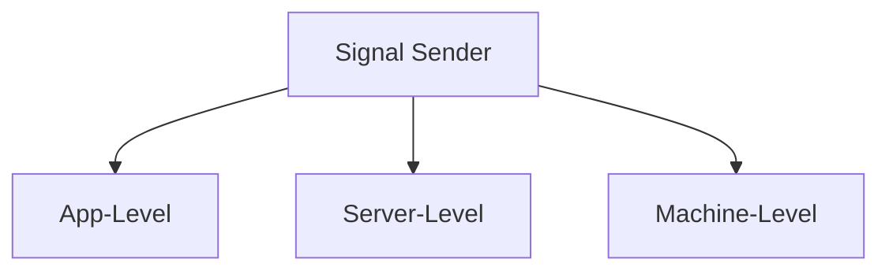

# Signals

<Ingress>
Signals enable inter-component communication in Ivy applications, allowing components to send and receive messages across the component tree.
They follow a publisher-subscriber pattern where components can send messages through signals and other components can listen for and respond to those messages.
</Ingress>

## Basic Usage

First, define a signal by creating a class that inherits from `AbstractSignal<TInput, TOutput>`:

```csharp demo-below
public class CounterSignal : AbstractSignal<int, string> { }

public class SignalExample : ViewBase
{
    public override object? Build()
    {
        var signal = Context.CreateSignal<CounterSignal, int, string>();
        var output = UseState("");

        async ValueTask OnClick(Event<Button> _)
        {
            var results = await signal.Send(1);
            output.Set(string.Join(", ", results));
        }

        return Layout.Vertical(
            new Button("Send Signal", OnClick),
            new ChildReceiver(),
            output
        );
    }
}

public class ChildReceiver : ViewBase
{
    public override object? Build()
    {
        var signal = Context.UseSignal<CounterSignal, int, string>();
        var counter = UseState(0);

        UseEffect(() => signal.Receive(input =>
        {
            counter.Set(counter.Value + input);
            return $"Child received: {input}, total: {counter.Value}";
        }));

        return new Card($"Counter: {counter.Value}");
    }
}
```

## Signal Communication Patterns

### One-to-Many Communication

This example demonstrates the one-to-many pattern where one sender broadcasts a message that multiple receivers all receive simultaneously.

```csharp demo-tabs
public class BroadcastSignal : AbstractSignal<string, Unit> { }

public class OneToManyDemo : ViewBase
{
    public override object? Build()
    {
        var signal = Context.CreateSignal<BroadcastSignal, string, Unit>();
        var message = UseState("");
        var receiver1Message = UseState("");
        var receiver2Message = UseState("");
        var receiver3Message = UseState("");
        
        async ValueTask BroadcastMessage(Event<Button> _)
        {
            if (!string.IsNullOrWhiteSpace(message.Value))
            {
                await signal.Send(message.Value);
                message.Set("");
            }
        }
        
        // Set up signal receiver
        var receiver = Context.UseSignal<BroadcastSignal, string, Unit>();
        
        // Process incoming messages
        UseEffect(() => receiver.Receive(message =>
        {
            // Each receiver processes the same message differently
            receiver1Message.Set($"Logged: {message}");
            receiver2Message.Set($"Analyzed: {message.Length} characters");
            receiver3Message.Set($"Stats: {message.Split(' ').Length} words");
            return new Unit();
        }));
        
        return Layout.Vertical(
            Layout.Horizontal(
                message.ToTextInput("Broadcast Message"),
                new Button("Send", BroadcastMessage)
            ),
            Layout.Horizontal(
                new Card(Text.Block(receiver1Message.Value)),
                new Card(Text.Block(receiver2Message.Value)),
                new Card(Text.Block(receiver3Message.Value))
            )
        );
    }
}
```

### Request-Response Pattern

This example demonstrates the request-response pattern where a requester sends a query and receives specific responses from providers. Unlike one-to-many broadcasting, this pattern expects specific data back from each provider.

```csharp demo-tabs
public class DataRequestSignal : AbstractSignal<string, string[]> { }

public class RequestResponseDemo : ViewBase
{
    public override object? Build()
    {
        var signal = Context.CreateSignal<DataRequestSignal, string, string[]>();
        var query = UseState<string>("");
        var results = UseState<string[]>(() => Array.Empty<string>());
        var isSearching = UseState<bool>(false);
        
        async ValueTask SearchData(Event<Button> _)
        {
            if (!string.IsNullOrWhiteSpace(query.Value))
            {
                isSearching.Set(true);
                
                // Send request via signal and get responses from all providers
                var responses = await signal.Send(query.Value);
                var allResults = responses.SelectMany(r => r).ToArray();
                
                results.Set(allResults);
                query.Set("");
                isSearching.Set(false);
            }
        }
        
        return Layout.Vertical(
            Text.Block("Try searching for: John, Jane, Laptop, Smartphone, Tablet"),
            Layout.Horizontal(
                query.ToTextInput("Search"),
                new Button("Search", SearchData)
            ),
            Text.Block(isSearching.Value ? "Searching..." : $"Found {results.Value.Length} results"),
            results.Value.Select(r => Text.Block(r)),
            Layout.Horizontal(
                new DataProvider("User Database", new[] { "John Doe", "Jane Smith", "Bob Johnson" }),
                new DataProvider("Product Catalog", new[] { "Laptop", "Smartphone", "Tablet" })
            )
        );
    }
}

public class DataProvider : ViewBase
{
    private readonly string _providerName;
    private readonly string[] _dataSource;
    
    public DataProvider(string providerName, string[] dataSource)
    {
        _providerName = providerName;
        _dataSource = dataSource;
    }
    
    public override object? Build()
    {
        var signal = Context.UseSignal<DataRequestSignal, string, string[]>();
        var processedQueries = UseState<int>(0);
        var lastQuery = UseState<string>("");
        
        UseEffect(() => signal.Receive(query =>
        {
            processedQueries.Set(processedQueries.Value + 1);
            lastQuery.Set(query);
            
            // Process the query and return results
            var matchingResults = _dataSource
                .Where(item => item.Contains(query, StringComparison.OrdinalIgnoreCase))
                .Select(item => $"[{_providerName}] {item}")
                .ToArray();
                
            return matchingResults;
        }));
        
        return new Card(
            Layout.Vertical(
                Text.Block(_providerName),
                Text.Block($"Data source: {string.Join(", ", _dataSource)}"),
                Text.Block($"Processed: {processedQueries.Value} queries"),
                Text.Block($"Last query: {lastQuery.Value}")
            )
        );
    }
}
```

## Broadcast Types

Signals can be configured to broadcast across different scopes:

### App-Level Broadcasting

```csharp
[Signal(BroadcastType.App)]
public class AppNotificationSignal : AbstractSignal<string, Unit> { }

[Signal(BroadcastType.Server)]
public class ServerEventSignal : AbstractSignal<ServerEvent, Unit> { }

[Signal(BroadcastType.Machine)]
public class SystemSignal : AbstractSignal<SystemEvent, Unit> { }
```



## See Also

- [State Management](./State.md)
- [Effects](./Effects.md)
