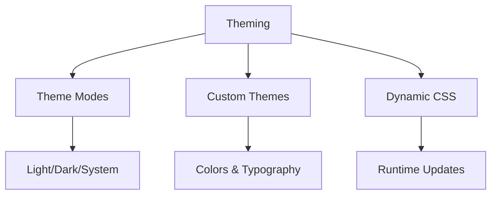
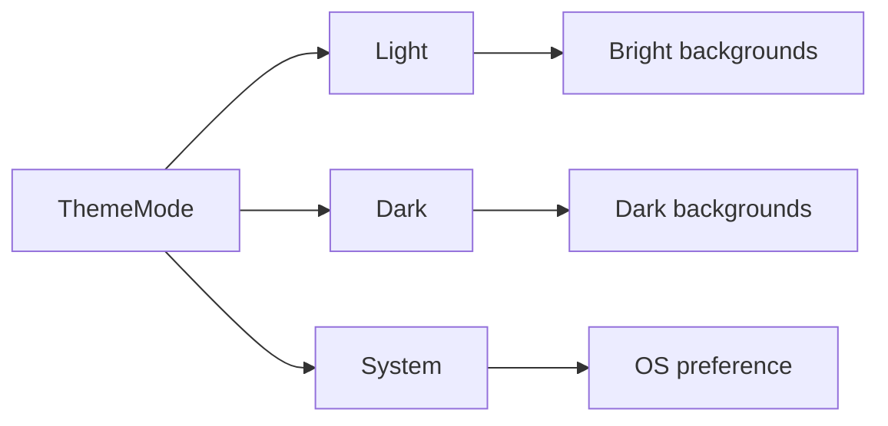

---
searchHints:
  - theme
  - styling
  - colors
  - dark-mode
  - customization
  - branding
---

# Theming

<Ingress>
Customize your Ivy application's visual appearance with flexible theming support including light/dark modes, custom color schemes, typography, and dynamic theme switching.
</Ingress>

## Overview

Ivy's theming system provides:



## Theme Modes

Control basic light/dark appearance:

```csharp
[App(icon: Icons.Palette)]
public class ThemeSwitcher : ViewBase
{
    public override object? Build()
    {
        var client = UseService<IClientProvider>();
        
        return Layout.Vertical()
            | new Button("Light")
            {
                OnClick = _ => 
                {
                    client.SetThemeMode(ThemeMode.Light);
                    return ValueTask.CompletedTask;
                }
            }
            | new Button("Dark")
            {
                OnClick = _ =>
                {
                    client.SetThemeMode(ThemeMode.Dark);
                    return ValueTask.CompletedTask;
                }
            }
            | new Button("System")
            {
                OnClick = _ =>
                {
                    client.SetThemeMode(ThemeMode.System);
                    return ValueTask.CompletedTask;
                }
            };
    }
}
```

### Options



## Custom Themes

### Server Configuration (Experimental)

The `UseTheme()` method is available for server-level theme configuration

```csharp
var server = new Server()
    .UseTheme(theme => {
        theme.Name = "Ocean";
        theme.Colors = new ThemeColorScheme
        {
            Light = new ThemeColors
            {
                Primary = "#0077BE",
                PrimaryForeground = "#FFFFFF",
                Secondary = "#5B9BD5",
                SecondaryForeground = "#FFFFFF",
                Background = "#F0F8FF",
                Foreground = "#1A1A1A",
                Destructive = "#DC143C",
                DestructiveForeground = "#FFFFFF",
                Success = "#20B2AA",
                SuccessForeground = "#FFFFFF",
                Warning = "#FFD700",
                WarningForeground = "#1A1A1A",
                Info = "#4682B4",
                InfoForeground = "#FFFFFF",
                Border = "#B0C4DE",
                Input = "#E6F2FF",
                Ring = "#0077BE",
                Muted = "#E0E8F0",
                MutedForeground = "#5A6A7A",
                Accent = "#87CEEB",
                AccentForeground = "#1A1A1A",
                Card = "#FFFFFF",
                CardForeground = "#1A1A1A",
                Popover = "#FFFFFF",
                PopoverForeground = "#1A1A1A",
                Chart1 = "#0077BE",
                Chart2 = "#DC143C",
                Chart3 = "#20B2AA",
                Chart4 = "#FFD700",
                Chart5 = "#4682B4",
                Sidebar = "#E0E8F0",
                SidebarForeground = "#1A1A1A",
                SidebarPrimary = "#0077BE",
                SidebarPrimaryForeground = "#FFFFFF",
                SidebarAccent = "#87CEEB",
                SidebarAccentForeground = "#1A1A1A",
                SidebarBorder = "#B0C4DE",
                SidebarRing = "#0077BE"
            },
            Dark = new ThemeColors
            {
                Primary = "#4A9EFF",
                PrimaryForeground = "#001122",
                Secondary = "#2D4F70",
                SecondaryForeground = "#E8F4FD",
                Background = "#001122",
                Foreground = "#E8F4FD",
                Destructive = "#FF6B7D",
                DestructiveForeground = "#FFFFFF",
                Success = "#4ECDC4",
                SuccessForeground = "#001122",
                Warning = "#FFE066",
                WarningForeground = "#001122",
                Info = "#87CEEB",
                InfoForeground = "#001122",
                Border = "#1A3A5C",
                Input = "#0F2A4A",
                Ring = "#4A9EFF",
                Muted = "#0F2A4A",
                MutedForeground = "#8BB3D9",
                Accent = "#1A3A5C",
                AccentForeground = "#E8F4FD",
                Card = "#0F2A4A",
                CardForeground = "#E8F4FD",
                Popover = "#001122",
                PopoverForeground = "#E8F4FD",
                Chart1 = "#4A9EFF",
                Chart2 = "#FF6B7D",
                Chart3 = "#4ECDC4",
                Chart4 = "#FFE066",
                Chart5 = "#87CEEB",
                Sidebar = "#0F2A4A",
                SidebarForeground = "#E8F4FD",
                SidebarPrimary = "#4A9EFF",
                SidebarPrimaryForeground = "#001122",
                SidebarAccent = "#1A3A5C",
                SidebarAccentForeground = "#E8F4FD",
                SidebarBorder = "#1A3A5C",
                SidebarRing = "#4A9EFF"
            }
        };
    });
```

### Runtime Theme Changes

Use `IThemeService` to modify themes dynamically. The `ApplyTheme()` method applies CSS custom properties generated from theme configurations:

```csharp
[App(icon: Icons.Brush)]
public class ThemeCustomizer : ViewBase
{
    public override object? Build()
    {
        var themeService = UseService<IThemeService>();
        var client = UseService<IClientProvider>();
        
        void ApplyCustomTheme()
        {
            var customTheme = new Theme
            {
                Name = "Ocean Blue",
                Colors = new ThemeColorScheme
                {
                    Light = new ThemeColors
                    {
                        Primary = "#0077be",
                        Background = "#ffffff",
                        Foreground = "#1a1a1a"
                    },
                    Dark = new ThemeColors
                    {
                        Primary = "#0099ff", 
                        Background = "#0d1117",
                        Foreground = "#ffffff"
                    }
                }
            };
            
            // Set the theme and generate CSS custom properties
            themeService.SetTheme(customTheme);
            var css = themeService.GenerateThemeCss();
            
            // Apply the generated CSS variables to the frontend
            client.ApplyTheme(css);
        }
        
        return new Button("Apply Ocean Theme")
        {
            OnClick = _ =>
            {
                ApplyCustomTheme();
                return ValueTask.CompletedTask;
            }
        };
    }
}
```

<Callout variant="Info">
`ApplyTheme()` only accepts CSS generated by `ThemeService.GenerateThemeCss()`. It does not support arbitrary custom CSS injection.
</Callout>
