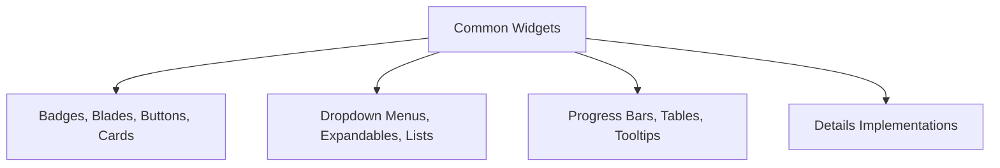
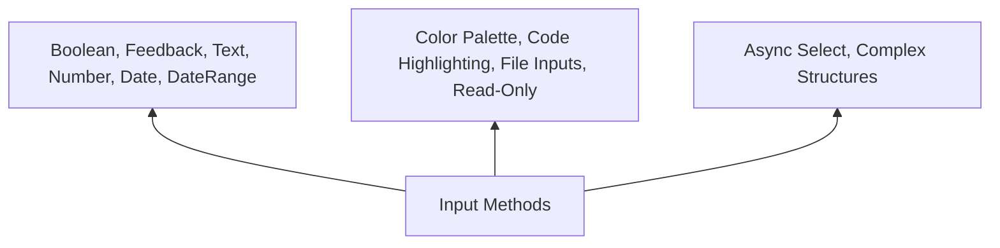
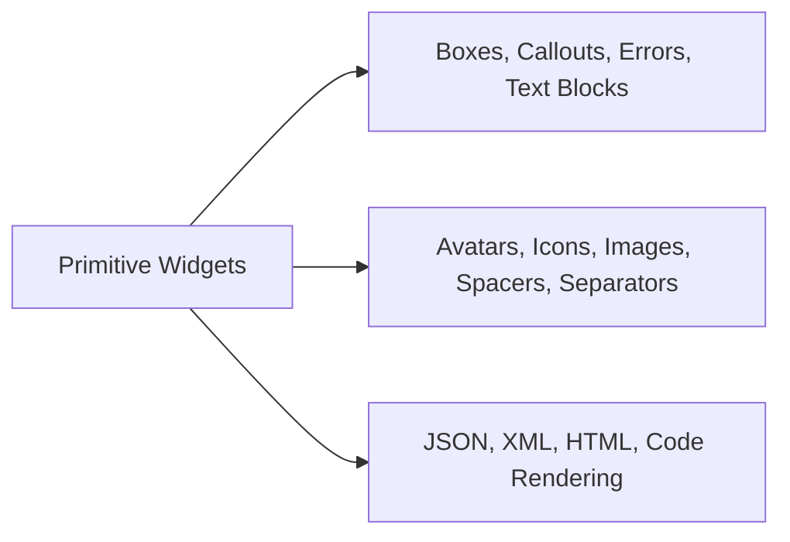
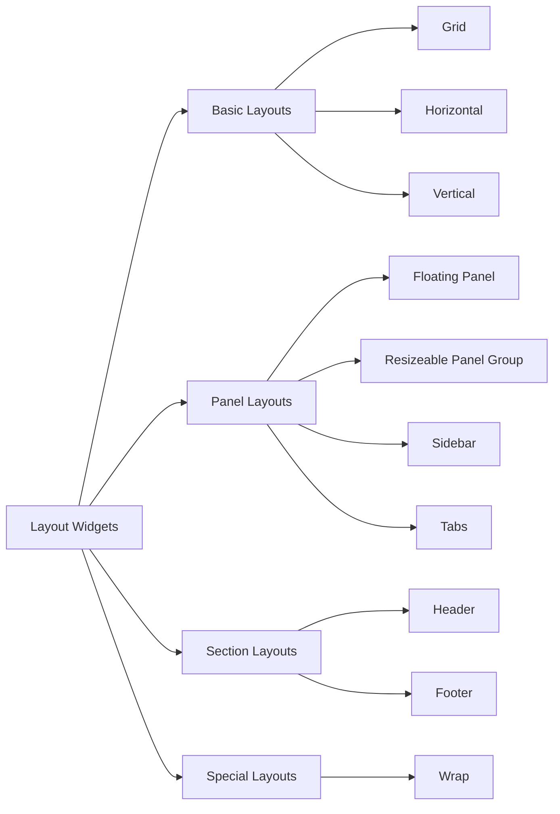
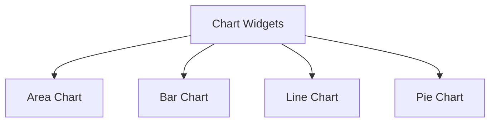

# Widgets

<Ingress>
Discover the fundamental building blocks of Ivy applications - Widgets provide declarative UI components inspired by React's component model.
</Ingress>

Widgets are the fundamental building blocks of the Ivy framework. They represent the smallest unit of UI and are used to construct Views. Inspired by React's component model, Widgets provide a declarative way to build user interfaces.

## Basic usage

Ivy provides a comprehensive set of widgets organized into several categories:

The most frequently used widgets for building user interfaces:

```csharp demo-below
Layout.Vertical().Gap(2)
    | new Badge("Primary")
    | new Badge("New")
    | new Button("Primary Button")
    | new Progress(75)
    | new Card("Card Content")
```

### Widget Library

Ivy ships with a comprehensive set of strongly-typed widgets:

| Category | Examples |
|----------|----------|
| Common | [Button](../../02_Widgets/01_Common/Button.md), [Badge](../../02_Widgets/01_Common/Badge.md), [Progress](../../02_Widgets/01_Common/Progress.md), [Table](../../02_Widgets/01_Common/Table.md), [Card](../../02_Widgets/01_Common/Card.md), [Tooltip](../../02_Widgets/01_Common/Tooltip.md), [Expandable](../../02_Widgets/01_Common/Expandable.md), [Blades](../../02_Widgets/01_Common/Blades.md), [Details](../../02_Widgets/01_Common/Details.md), [DropDownMenu](../../02_Widgets/01_Common/DropDownMenu.md), [List](../../02_Widgets/01_Common/List.md)... |
| Inputs | [TextInput](../../02_Widgets/02_Inputs/Text.md), [NumberInput](../../02_Widgets/02_Inputs/Number.md), [BoolInput](../../02_Widgets/02_Inputs/Bool.md), [DateTimeInput](../../02_Widgets/02_Inputs/DateTime.md), [FileInput](../../02_Widgets/02_Inputs/File.md), [Feedback](../../02_Widgets/02_Inputs/Feedback.md), [DateRange](../../02_Widgets/02_Inputs/DateRange.md), [Color](../../02_Widgets/02_Inputs/Color.md), [Code](../../02_Widgets/02_Inputs/Code.md), [ReadOnly](../../02_Widgets/02_Inputs/ReadOnly.md), [AsyncSelect](../../02_Widgets/02_Inputs/AsyncSelect.md)... |
| Primitives | [Text](../../02_Widgets/03_Primitives/TextBlock.md), [Icon](../../02_Widgets/03_Primitives/Icon.md), [Image](../../02_Widgets/03_Primitives/Image.md), [Markdown](../../02_Widgets/03_Primitives/Markdown.md), [Json](../../02_Widgets/03_Primitives/Json.md), [Code](../../02_Widgets/03_Primitives/Code.md), [Avatar](../../02_Widgets/03_Primitives/Avatar.md), [Box](../../02_Widgets/03_Primitives/Box.md), [Callout](../../02_Widgets/03_Primitives/Callout.md), [Error](../../02_Widgets/03_Primitives/Error.md), [Spacer](../../02_Widgets/03_Primitives/Spacer.md), [Separator](../../02_Widgets/03_Primitives/Separator.md), [Xml](../../02_Widgets/03_Primitives/Xml.md), [Html](../../02_Widgets/03_Primitives/Html.md)... |
| Layouts | [GridLayout](../../02_Widgets/04_Layouts/GridLayout.md), [TabsLayout](../../02_Widgets/04_Layouts/TabsLayout.md), [SidebarLayout](../../02_Widgets/04_Layouts/SidebarLayout.md), [FloatingPanel](../../02_Widgets/04_Layouts/FloatingPanel.md), [ResizeablePanelGroup](../../02_Widgets/04_Layouts/ResizeablePanelGroup.md), [Header](../../02_Widgets/04_Layouts/HeaderLayout.md), [Footer](../../02_Widgets/04_Layouts/FooterLayout.md), [Wrap](../../02_Widgets/04_Layouts/WrapLayout.md)... |
| Effects | [Animation](../../02_Widgets/05_Effects/Animation.md), [Confetti](../../02_Widgets/05_Effects/Confetti.md)... |
| Charts | [LineChart](../../02_Widgets/06_Charts/LineChart.md), [BarChart](../../02_Widgets/06_Charts/BarChart.md), [PieChart](../../02_Widgets/06_Charts/PieChart.md), [AreaChart](../../02_Widgets/06_Charts/AreaChart.md)... |
| Advanced | [Sheet](../../02_Widgets/07_Advanced/Sheet.md), [Chat](../../02_Widgets/07_Advanced/Chat.md)... |

### Common Widgets

The common widgets category offers you the opportunity to work with essential UI elements including badges, blades, buttons, cards, details implementations, dropdown menus, expandable sections, lists, progress bars, tables, and tooltips. Each widget is designed with Ivy's signature approach to simplicity and functionality.



### Input Widgets

We also provide our users with various input methods to capture user data. Users can work with simple input types such as boolean inputs, feedback forms, text inputs, number inputs, date ranges, and date-time pickers. Additionally, we offer specialized features including Ivy's color palette system and our implementation of code highlighting. We introduce our file input implementations, read-only statements, and provide the ability to work with complex structures like async select operations in a simple, intuitive way.



### Primitives

Ivy also provides a special experience when working with primitive widgets. We make complex tasks simpler through our implementation of boxes, callouts, error displays, and text blocks. You can easily add avatars, icons, images, spacers, and separators to enhance your interfaces. We also provide our own implementations of JSON, XML, HTML, and code rendering capabilities.



### Layouts

Ivy makes working with layouts not just easier, but satisfying. We provide a much more intuitive way to work with layouts and their elements, allowing you to create complex arrangements with minimal effort.



### Charts

Additionally, Ivy has its own implementation of charts, which makes data visualization much simpler to work with.



### Effects

Ivy provides a rich collection of built-in effects and animations to enhance your user interfaces. Working with effects in Ivy is incredibly simple and intuitive. For detailed information about specific effects, refer to the animation and confetti documentation pages.

### Advanced

In the Advanced section, we introduce our specialized implementations for working with sheets and chat functionality. These advanced widgets provide sophisticated features for complex user interface requirements.
