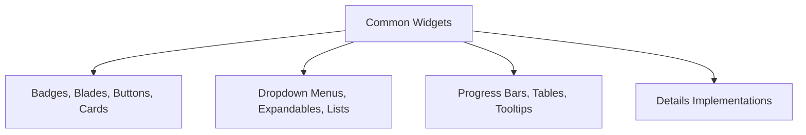
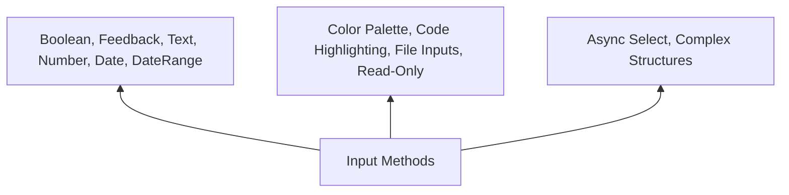
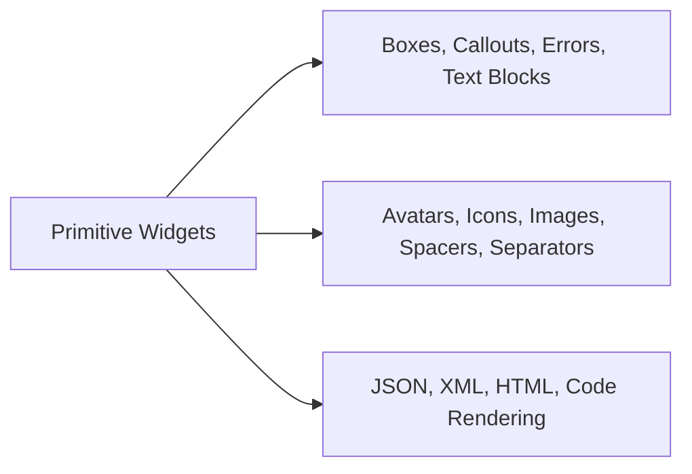
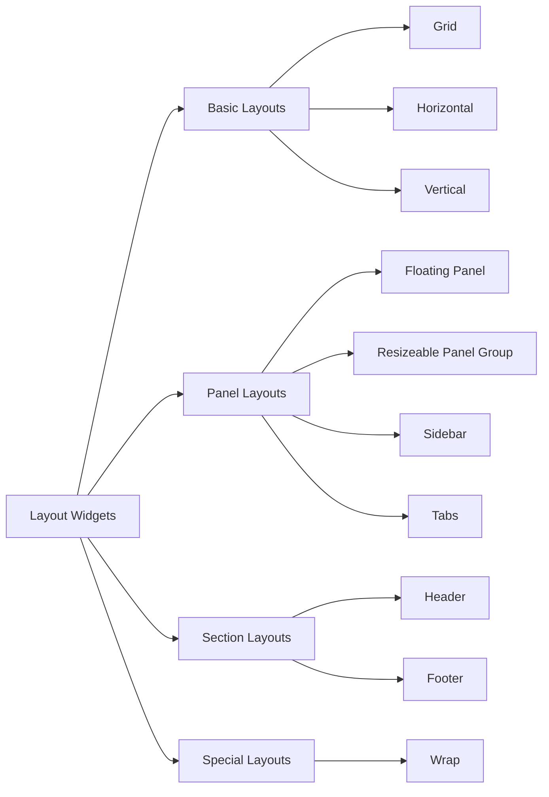
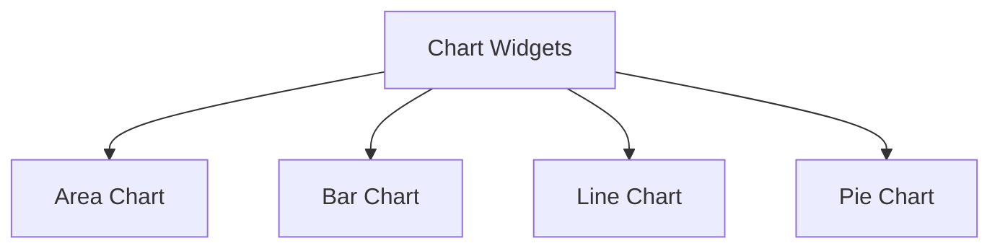

---
searchHints:
  - components
  - ui
  - building-blocks
  - elements
  - widgets
  - primitives
---

# Widgets

<Ingress>
Discover the fundamental building blocks of Ivy applications - Widgets provide declarative UI components inspired by React's component model.
</Ingress>

Widgets are the fundamental building blocks of the Ivy framework. They represent the smallest unit of UI and are used to construct Views. Inspired by React's component model, Widgets provide a declarative way to build user interfaces.

## Basic usage

Ivy provides a comprehensive set of widgets organized into several categories:

The most frequently used widgets for building user interfaces:

```csharp demo-below
Layout.Vertical().Gap(2)
    | new Badge("Primary")
    | new Badge("New")
    | new Button("Primary Button")
    | new Progress(75)
    | new Card("Card Content")
```

### Widget Library

Ivy ships with a comprehensive set of strongly-typed widgets:

| Category | Examples |
|----------|----------|
| Common | [Button](../../02_Widgets/01_Common/Button.md), [Badge](../../02_Widgets/01_Common/Badge.md), [Progress](../../02_Widgets/01_Common/Progress.md), [Table](../../02_Widgets/01_Common/Table.md), [Card](../../02_Widgets/01_Common/Card.md), [Tooltip](../../02_Widgets/01_Common/Tooltip.md), [Expandable](../../02_Widgets/01_Common/Expandable.md), [Blades](../../02_Widgets/01_Common/Blades.md), [Details](../../02_Widgets/01_Common/Details.md), [DropDownMenu](../../02_Widgets/01_Common/DropDownMenu.md), [List](../../02_Widgets/01_Common/List.md)... |
| Inputs | [TextInput](../../02_Widgets/02_Inputs/Text.md), [NumberInput](../../02_Widgets/02_Inputs/Number.md), [BoolInput](../../02_Widgets/02_Inputs/Bool.md), [DateTimeInput](../../02_Widgets/02_Inputs/DateTime.md), [FileInput](../../02_Widgets/02_Inputs/File.md), [Feedback](../../02_Widgets/02_Inputs/Feedback.md), [DateRange](../../02_Widgets/02_Inputs/DateRange.md), [Color](../../02_Widgets/02_Inputs/Color.md), [CodeInput](../../02_Widgets/02_Inputs/CodeInput.md), [ReadOnly](../../02_Widgets/02_Inputs/ReadOnly.md), [AsyncSelect](../../02_Widgets/02_Inputs/AsyncSelect.md)... |
| Primitives | [Text](../../02_Widgets/03_Primitives/TextBlock.md), [Icon](../../02_Widgets/03_Primitives/Icon.md), [Image](../../02_Widgets/03_Primitives/Image.md), [Markdown](../../02_Widgets/03_Primitives/Markdown.md), [Json](../../02_Widgets/03_Primitives/Json.md), [Code](../../02_Widgets/03_Primitives/Code.md), [Avatar](../../02_Widgets/03_Primitives/Avatar.md), [Box](../../02_Widgets/03_Primitives/Box.md), [Callout](../../02_Widgets/03_Primitives/Callout.md), [Error](../../02_Widgets/03_Primitives/Error.md), [Spacer](../../02_Widgets/03_Primitives/Spacer.md), [Separator](../../02_Widgets/03_Primitives/Separator.md), [Xml](../../02_Widgets/03_Primitives/Xml.md), [Html](../../02_Widgets/03_Primitives/Html.md)... |
| Layouts | [GridLayout](../../02_Widgets/04_Layouts/GridLayout.md), [TabsLayout](../../02_Widgets/04_Layouts/TabsLayout.md), [SidebarLayout](../../02_Widgets/04_Layouts/SidebarLayout.md), [FloatingPanel](../../02_Widgets/04_Layouts/FloatingPanel.md), [ResizeablePanelGroup](../../02_Widgets/04_Layouts/ResizeablePanelGroup.md), [Header](../../02_Widgets/04_Layouts/HeaderLayout.md), [Footer](../../02_Widgets/04_Layouts/FooterLayout.md), [Wrap](../../02_Widgets/04_Layouts/WrapLayout.md)... |
| Effects | [Animation](../../02_Widgets/05_Effects/Animation.md), [Confetti](../../02_Widgets/05_Effects/Confetti.md)... |
| Charts | [LineChart](../../02_Widgets/06_Charts/LineChart.md), [BarChart](../../02_Widgets/06_Charts/BarChart.md), [PieChart](../../02_Widgets/06_Charts/PieChart.md), [AreaChart](../../02_Widgets/06_Charts/AreaChart.md)... |
| Advanced | [Sheet](../../02_Widgets/07_Advanced/Sheet.md), [Chat](../../02_Widgets/07_Advanced/Chat.md)... |

### Common Widgets

The common widgets category offers you the opportunity to work with essential UI elements including badges, blades, buttons, cards, details implementations, dropdown menus, expandable sections, lists, progress bars, tables, and tooltips. Each widget is designed with Ivy's signature approach to simplicity and functionality.



```csharp demo-tabs
public class CommonWidgetsDemo : ViewBase
{
    public override object? Build()
    {
        var client = this.UseService<IClientProvider>();
        return Layout.Grid().Columns(2).Gap(4)
            | new Card(
                Layout.Horizontal().Gap(2)
                    | new Button("Click Me", onClick: _ => client.Toast("Hello!"))
                    | new Button("Destructive").Destructive()
                    | new Button("Secondary").Secondary()
            ).Title("Buttons").Description("Interactive button variants").Height(Size.Units(40))
            | new Card(
                Layout.Wrap().Gap(2)
                    | new Badge("Primary")
                    | new Badge("Success").Icon(Icons.Check)
                    | new Badge("Outline").Outline()
            ).Title("Badges").Description("Status and label badges").Height(Size.Units(40))
            | new Card(
                Layout.Vertical().Gap(2)
                    | new Progress(50).Goal("Task completion")
                    | new Progress(75).ColorVariant(Progress.ColorVariants.EmeraldGradient)
                    | new Progress(90)
            ).Title("Progress").Description("Task completion indicators").Height(Size.Units(50))
            | new Card(
                Layout.Vertical().Gap(2)
                    | new Card("Clickable Card").HandleClick(_ => client.Toast("Clicked!"))
            ).Title("Cards").Description("Content containers").Height(Size.Units(50))
            | new Card(
                new[] {
                    new { Name = "Apple", Price = 1.20 },
                    new { Name = "Banana", Price = 0.80 },
                    new { Name = "Cherry", Price = 2.50 }
                }.ToTable()
            ).Title("Table").Description("Structured data display").Height(Size.Units(70))
            | new Card(
                Layout.Vertical().Gap(2)
                    | new Expandable("Click to expand", "Hidden content appears here")
                    | new Expandable("Another section", "More expandable content")
            ).Title("Expandable").Description("Collapsible sections").Height(Size.Units(70))
            | new Card(
                new List(new[]
                {
                    new ListItem("First item", icon: Icons.Circle),
                    new ListItem("Second item", icon: Icons.Circle),
                    new ListItem("Third item", icon: Icons.Circle)
                })
            ).Title("List").Description("Vertical item lists").Height(Size.Units(70))
            | new Card(
                new { Name = "John Doe", Email = "john@example.com", Role = "Admin" }
                    .ToDetails()
            ).Title("Details").Description("Label-value pairs").Height(Size.Units(70))
            | new Card(
                Layout.Vertical().Align(Align.Center)
                    | new DropDownMenu(_ => { }, 
                        new Button("Menu"),
                        MenuItem.Default("Profile"),
                        MenuItem.Default("Settings"),
                        MenuItem.Separator(),
                        MenuItem.Default("Logout"))
            ).Title("DropDownMenu").Description("Action menus").Height(Size.Units(40))
            | new Card(
                Layout.Horizontal().Align(Align.Center).Gap(2)
                    | new Button("Hover", icon: Icons.Info).WithTooltip("This is a tooltip")
                    | new Button("Help", icon: Icons.CircleQuestionMark).WithTooltip("Get help here")
            ).Title("Tooltip").Description("Contextual information").Height(Size.Units(40));
    }
}
```

### Input Widgets

We also provide our users with various input methods to capture user data. Users can work with simple input types such as boolean inputs, feedback forms, text inputs, number inputs, date ranges, and date-time pickers. Additionally, we offer specialized features including Ivy's color palette system and our implementation of code highlighting. We introduce our file input implementations, read-only statements, and provide the ability to work with complex structures like async select operations in a simple, intuitive way.



```csharp demo-tabs
public class InputWidgetsDemo : ViewBase
{
    private static readonly string[] Categories = { "Electronics", "Clothing", "Books", "Home & Garden", "Sports" };
    
    public override object? Build()
    {
        var textState = UseState("");
        var numberState = UseState(0);
        var boolState = UseState(false);
        var dateState = UseState(DateTime.Now);
        var dateRangeState = UseState<(DateOnly?, DateOnly?)>((null, null));
        var colorState = UseState("#00cc92");
        var codeState = UseState("var x = 10;");
        var fileState = UseState<FileUpload<byte[]>?>();
        var fileUpload = this.UseUpload(MemoryStreamUploadHandler.Create(fileState));
        var feedbackState = UseState(4);
        var selectState = UseState("");
        var asyncSelectState = UseState((string?)null);
        
        var selectedCategory = this.UseState<string?>(default(string?));

        Task<Option<string>[]> QueryCategories(string query)
        {
            return Task.FromResult(Categories
                .Where(c => c.Contains(query, StringComparison.OrdinalIgnoreCase))
                .Select(c => new Option<string>(c))
                .ToArray());
        }

        Task<Option<string>?> LookupCategory(string? category)
        {
            return Task.FromResult(category != null ? new Option<string>(category) : null);
        }
        
        return Layout.Grid().Columns(2).Gap(4).Width(Size.Full())
            | new Card(
                Layout.Vertical().Gap(2)
                    | new TextInput(textState).Placeholder("Enter text...")
                    | new TextInput(textState).Variant(TextInputs.Password).Placeholder("Password")
                    | new TextInput(textState).Variant(TextInputs.Email).Placeholder("Email")
                    | new TextInput(textState).Variant(TextInputs.Search).Placeholder("Search...")
            ).Title("TextInput").Description("Text input variants").Height(Size.Units(80))
            | new Card(
                Layout.Vertical().Gap(2)
                    | new NumberInput<double>(numberState).Min(0).Max(100).Variant(NumberInputs.Slider)
                    | new NumberInput<int>(numberState).Placeholder("Enter number")
                    | new NumberInput<decimal>(numberState).FormatStyle(NumberFormatStyle.Currency).Currency("USD").Placeholder("$0.00")
                    | new NumberInput<double>(numberState).FormatStyle(NumberFormatStyle.Percent).Placeholder("0%")
            ).Title("NumberInput").Description("Number and slider").Height(Size.Units(80))
            | new Card(
                Layout.Vertical().Gap(2)
                    | new BoolInput(boolState).Label("Accept terms and conditions")
                    | boolState.ToSwitchInput().Label("Enable notifications")
            ).Title("BoolInput").Description("Checkbox input").Height(Size.Units(65))
            | new Card(
                Layout.Vertical().Gap(2)
                    | fileState.ToFileInput(fileUpload).Placeholder("Upload file")
            ).Title("FileInput").Description("File upload").Height(Size.Units(65))
            | new Card(
                dateRangeState.ToDateRangeInput().Placeholder("Select date range")
            ).Title("DateRange").Description("Date range picker").Height(Size.Units(40))
            | new Card(
                new DateTimeInput<DateTime>(dateState).Placeholder("Select date")
            ).Title("DateTimeInput").Description("Date and time picker").Height(Size.Units(40))
            | new Card(
                new FeedbackInput<int>(feedbackState).Variant(FeedbackInputs.Stars)
            ).Title("Feedback").Description("Star rating").Height(Size.Units(40))
            | new Card(
                colorState.ToColorInput().Variant(ColorInputs.Picker)
            ).Title("Color").Description("Color picker").Height(Size.Units(40))
            | new Card(
                codeState.ToCodeInput().Language(Languages.Javascript).Height(Size.Units(15))
            ).Title("Code").Description("Code editor").Height(Size.Units(50))
            | new Card(
                selectState.ToSelectInput(new[] { "Option 1", "Option 2", "Option 3" }.ToOptions()).Placeholder("Select option")
            ).Title("Select").Description("Dropdown select").Height(Size.Units(50))
            | new Card(
                new ReadOnlyInput<string>("Read-only value")
            ).Title("ReadOnly").Description("Read-only display").Height(Size.Units(40))
            | new Card(
                selectedCategory.ToAsyncSelectInput(QueryCategories, LookupCategory, "Search categories...")
            ).Title("AsyncSelect").Description("Async dropdown").Height(Size.Units(40));
    }
}
```

### Primitives

Ivy also provides a special experience when working with primitive widgets. We make complex tasks simpler through our implementation of boxes, callouts, error displays, and text blocks. You can easily add avatars, icons, images, spacers, and separators to enhance your interfaces. We also provide our own implementations of JSON, XML, HTML, and code rendering capabilities.



```csharp demo-tabs
public class PrimitiveWidgetsDemo : ViewBase
{
    public override object? Build()
    {
        return Layout.Grid().Columns(2).Gap(4).Width(Size.Full())
            | new Card(
                Layout.Vertical().Gap(2)
                    | Text.H3("Heading 3")
                    | Text.P("Paragraph text")
                    | Text.Label("Label text")
                    | Text.Large("Large text")
                    | Text.Lead("Lead text")
            ).Title("Text").Description("Text variants").Height(Size.Units(75))
            | new Card(
                Layout.Vertical().Align(Align.Center)
                    | new Image("https://api.images.cat/150/150")
            ).Title("Image").Description("Image display").Height(Size.Units(75))
            | new Card(
                Layout.Horizontal().Gap(4)
                    | new Icon(Icons.Heart, Colors.Red)
                    | new Icon(Icons.Star, Colors.Yellow)
                    | new Icon(Icons.Check, Colors.Green)
                    | new Icon(Icons.Settings, Colors.Blue)
                    | new Icon(Icons.Bell, Colors.Orange)
                    | new Icon(Icons.Mail, Colors.Purple)
                    | new Icon(Icons.User, Colors.Cyan)
            ).Title("Icon").Description("Vector icons").Height(Size.Units(40))
            | new Card(
                Layout.Horizontal().Gap(2)
                    | new Avatar("John Doe")
                    | new Avatar("JD", "https://api.images.cat/150/150?1")
                    | new Avatar("AB")
                    | new Avatar("Mary Smith")
                    | new Avatar("TC", "https://api.images.cat/150/150?2")
                    | new Avatar("XY")
            ).Title("Avatar").Description("User avatars").Height(Size.Units(40))
            | new Card(
                Layout.Vertical().Gap(2)
                    | Callout.Info("Info message")
                    | Callout.Warning("Warning message")
            ).Title("Callout").Description("Alert messages").Height(Size.Units(70))
            | new Card(
                Layout.Vertical().Gap(2)
                    | new Box("Solid border").BorderStyle(BorderStyle.Solid)
                    | new Box("Full radius").BorderRadius(BorderRadius.Full)
            ).Title("Box").Description("Content container").Height(Size.Units(70))
            | new Card(
                Layout.Vertical().Gap(2)
                    | Text.P("Content above")
                    | new Separator()
                    | Text.P("Content below")
            ).Title("Separator").Description("Visual divider").Height(Size.Units(50))
            | new Card(
                Layout.Vertical()
                    | Text.P("Top content")
                    | new Spacer().Height(Size.Units(4))
                    | Text.P("Bottom content")
            ).Title("Spacer").Description("Empty space").Height(Size.Units(50))
            | new Card(
                Text.Code("var x = 10;\nconsole.log(x);", Languages.Javascript)
            ).Title("Code").Description("Syntax highlighting").Height(Size.Units(60))
            | new Card(
                new Markdown("**Bold** and *italic* text\n\n- Item 1\n- Item 2")
            ).Title("Markdown").Description("Markdown rendering").Height(Size.Units(60))
            | new Card(
                Text.Json("{ \"name\": \"value\", \"count\": 42 }")
            ).Title("Json").Description("JSON display").Height(Size.Units(50))
            | new Card(
                Text.Xml("<root><item>Value</item></root>")
            ).Title("Xml").Description("XML display").Height(Size.Units(50))
            | new Card(
                Text.Html("<div><strong>Bold</strong> text and <em>italic</em> text</div>")
            ).Title("Html").Description("HTML rendering").Height(Size.Units(40))
            | new Card(
                new Error("An error occurred")
            ).Title("Error").Description("Error display").Height(Size.Units(40));
    }
}
```

### Layouts

Ivy makes working with layouts not just easier, but satisfying. We provide a much more intuitive way to work with layouts and their elements, allowing you to create complex arrangements with minimal effort.



```csharp demo-tabs
public class LayoutWidgetsDemo : ViewBase
{
    public override object? Build()
    {
        var showPanel = UseState(false);
        var gridLayouts = Layout.Vertical().Gap(4).Width(Size.Full())
            | new Card(
                Layout.Grid().Columns(2).Width(Size.Full()).Gap(2)
                    | new Box("1").Width(Size.Full())
                    | new Box("2").Width(Size.Full())
                    | new Box("3").Width(Size.Full())
                    | new Box("4").Width(Size.Full())
            ).Title("GridLayout").Description("2D grid arrangement").Height(Size.Units(50))
            | new Card(
                new HeaderLayout(
                    header: new Card("Fixed Header Area").Title("Header"),
                    content: Layout.Vertical().Gap(2)
                        | Text.P("More scrollable content")
                )
            ).Title("Header").Description("Fixed header").Height(Size.Units(60))
            | new Card(
                new FooterLayout(
                    footer: Layout.Horizontal().Gap(2)
                        | new Button("Cancel").Secondary()
                        | new Button("Save"),
                    content: Layout.Vertical().Gap(2)
                        | Text.P("Footer stays at bottom")
                )
            ).Title("Footer").Description("Fixed footer").Height(Size.Units(60));
        
        var verticalLayouts = Layout.Grid().Columns(2).Gap(4).Width(Size.Full())
            | new Card(
                Layout.Horizontal().Gap(2)
                    | new Box("Item 1").Width(Size.Fraction(1/3f))
                    | new Box("Item 2").Width(Size.Fraction(1/3f))
                    | new Box("Item 3").Width(Size.Fraction(1/3f))
            ).Title("Horizontal").Description("Horizontal flow").Height(Size.Units(50))
            | new Card(
                Layout.Vertical().Gap(2)
                    | new Box("Item 1").Width(Size.Full())
                    | new Box("Item 2").Width(Size.Full())
            ).Title("Vertical").Description("Vertical stack").Height(Size.Units(50))
            | new Card(
                Layout.Wrap().Gap(2)
                    | new Badge("Item 1")
                    | new Badge("Item 2")
                    | new Badge("Item 3")
                    | new Badge("Item 4")
                    | new Badge("Item 5")
                    | new Badge("Item 6")
                    | new Badge("Item 7")
            ).Title("Wrap").Description("Auto-wrapping layout").Height(Size.Units(50))
            | new Card(
                Layout.Tabs(
                    new Tab("Tab 1", new Badge("Content 1")),
                    new Tab("Tab 2", new Badge("Content 2")),
                    new Tab("Tab 3", new Badge("Content 3"))
                )
            ).Title("TabsLayout").Description("Tabbed interface").Height(Size.Units(50))
            | new Card(
                Layout.Vertical().Gap(4)
                | new Card(
                    Layout.Horizontal().Gap(2).Align(Align.Center)
                        | new Button("Show Panel", onClick: _ => showPanel.Set(true))
                        | new Button("Hide Panel", onClick: _ => showPanel.Set(false))
                ).Width(Size.Full())
                | (showPanel.Value ? new FloatingPanel(
                    new Button("Floating Action")
                        .Icon(Icons.Plus)
                        .Large()
                        .BorderRadius(BorderRadius.Full)
                ) : null)
            ).Title("FloatingPanel").Description("Fixed position overlay").Height(Size.Units(60))
            | new Card(
                new ResizeablePanelGroup(
                    new ResizeablePanel(40,
                        new Card("Left")),
                    new ResizeablePanel(60,
                        new Card("Right"))
                )
            ).Title("ResizeablePanelGroup").Description("Resizable panels").Height(Size.Units(60));
        
        return Layout.Vertical().Gap(4)
            | verticalLayouts
            | gridLayouts;
    }
}
```

### Charts

Additionally, Ivy has its own implementation of charts, which makes data visualization much simpler to work with.



```csharp demo-tabs
public class ChartWidgetsDemo : ViewBase
{
    public override object? Build()
    {
        var data = new[]
        {
            new { Month = "Jan", Desktop = 186, Mobile = 100 },
            new { Month = "Feb", Desktop = 305, Mobile = 200 },
            new { Month = "Mar", Desktop = 237, Mobile = 300 },
            new { Month = "Apr", Desktop = 186, Mobile = 100 }
        };
        
        return Layout.Grid().Columns(2).Gap(4).Width(Size.Full())
            | new Card(
                data.ToLineChart()
                    .Dimension("Month", e => e.Month)
                    .Measure("Desktop", e => e.Sum(f => f.Desktop))
                    .Measure("Mobile", e => e.Sum(f => f.Mobile))
            ).Title("LineChart").Description("Trend visualization").Height(Size.Units(100))
            | new Card(
                data.ToBarChart()
                    .Dimension("Month", e => e.Month)
                    .Measure("Desktop", e => e.Sum(f => f.Desktop))
            ).Title("BarChart").Description("Bar comparison").Height(Size.Units(100))
            | new Card(
                data.ToAreaChart()
                    .Dimension("Month", e => e.Month)
                    .Measure("Desktop", e => e.Sum(f => f.Desktop))
            ).Title("AreaChart").Description("Area under curve").Height(Size.Units(120))
            | new Card(
                data.ToPieChart(
                    e => e.Month,
                    e => e.Sum(f => f.Desktop))
            ).Title("PieChart").Description("Part-to-whole").Height(Size.Units(120));
    }
}
```

### Effects

Ivy provides a rich collection of built-in effects and animations to enhance your user interfaces. Working with effects in Ivy is incredibly simple and intuitive. For detailed information about specific effects, refer to the animation and confetti documentation pages.

```csharp demo-tabs ivy-bg
public class EffectWidgetsDemo : ViewBase
{
    public override object? Build()
    {
        return Layout.Grid().Columns(2).Gap(4).Width(Size.Full())
            | new Card(
                Layout.Horizontal().Align(Align.Center).Gap(2)
                    | new Button("Click Confetti").WithConfetti(AnimationTrigger.Click)
                    | new Button("Hover Confetti").WithConfetti(AnimationTrigger.Hover)
            ).Title("Confetti").Description("Celebration effects").Height(Size.Units(40))
            | new Card(
                Layout.Horizontal().Gap(4)
                    | Icons.Heart.ToIcon().Color(Colors.Red).WithAnimation(AnimationType.Pulse).Trigger(AnimationTrigger.Click)
                    | Icons.Bell.ToIcon().Color(Colors.Orange).WithAnimation(AnimationType.Shake).Trigger(AnimationTrigger.Click)
                    | Icons.Star.ToIcon().Color(Colors.Yellow).WithAnimation(AnimationType.Bounce).Trigger(AnimationTrigger.Click)
                    | Icons.LoaderCircle.ToIcon().Color(Colors.Blue).WithAnimation(AnimationType.Rotate).Trigger(AnimationTrigger.Click)
                    | Icons.Zap.ToIcon().Color(Colors.Purple).WithAnimation(AnimationType.Pulse).Trigger(AnimationTrigger.Click)
                    | Icons.TrendingUp.ToIcon().Color(Colors.Green).WithAnimation(AnimationType.Bounce).Trigger(AnimationTrigger.Click)
                    | Icons.Sparkles.ToIcon().Color(Colors.Pink).WithAnimation(AnimationType.Rotate).Trigger(AnimationTrigger.Click)
                    | Icons.CircleAlert.ToIcon().Color(Colors.Destructive).WithAnimation(AnimationType.Shake).Trigger(AnimationTrigger.Click)
            ).Title("Animation").Description("Click icons to animate").Height(Size.Units(40));
    }
}
```

### Advanced

In the Advanced section, we introduce our specialized implementations for working with sheets and chat functionality. These advanced widgets provide sophisticated features for complex user interface requirements.

```csharp demo-tabs
public class AdvancedWidgetsDemo : ViewBase
{
    public override object? Build()
    {
        var messages = UseState(ImmutableArray.Create<ChatMessage>(
            new ChatMessage(ChatSender.Assistant, "Hello! I'm a demo chat bot.")
        ));
        
        void OnSendMessage(Event<Chat, string> @event)
        {
            var currentMessages = messages.Value;
            messages.Set(currentMessages.Add(new ChatMessage(ChatSender.User, @event.Value)));
            messages.Set(currentMessages.Add(new ChatMessage(ChatSender.Assistant, $"You said: {@event.Value}")));
        }
        
        return Layout.Vertical().Gap(4).Width(Size.Full())
            | new Card(
                new Button("Open Sheet").WithSheet(
                    () => Layout.Vertical()
                        | Text.H3("Sheet Content")
                        | Text.P("This is content inside a sheet")
                        | new Button("Close"),
                    title: "Demo Sheet",
                    description: "Sheet demonstration"
                )
            ).Title("Sheet").Description("Side panel overlay").Height(Size.Units(40))
            | new Card(
                new Chat(messages.Value.ToArray(), OnSendMessage)
                    .Height(Size.Units(30))
            ).Title("Chat").Description("Conversation interface").Height(Size.Units(70));
    }
}
```
