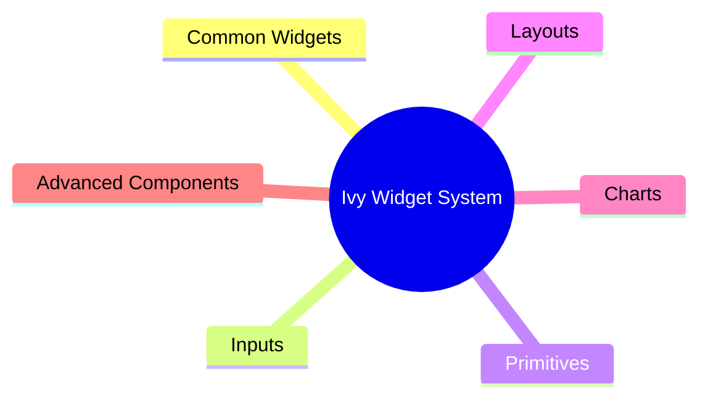
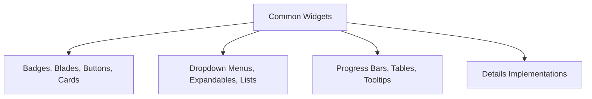
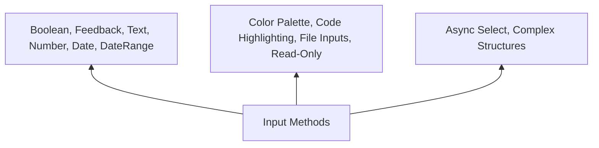
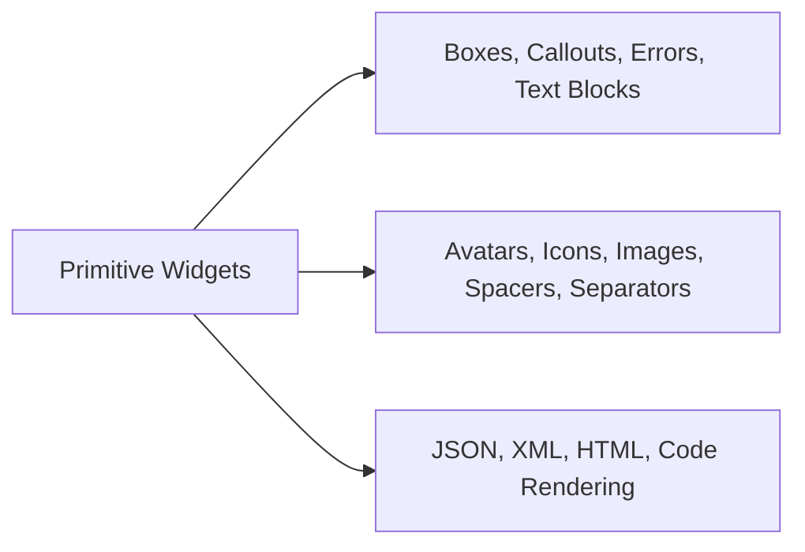
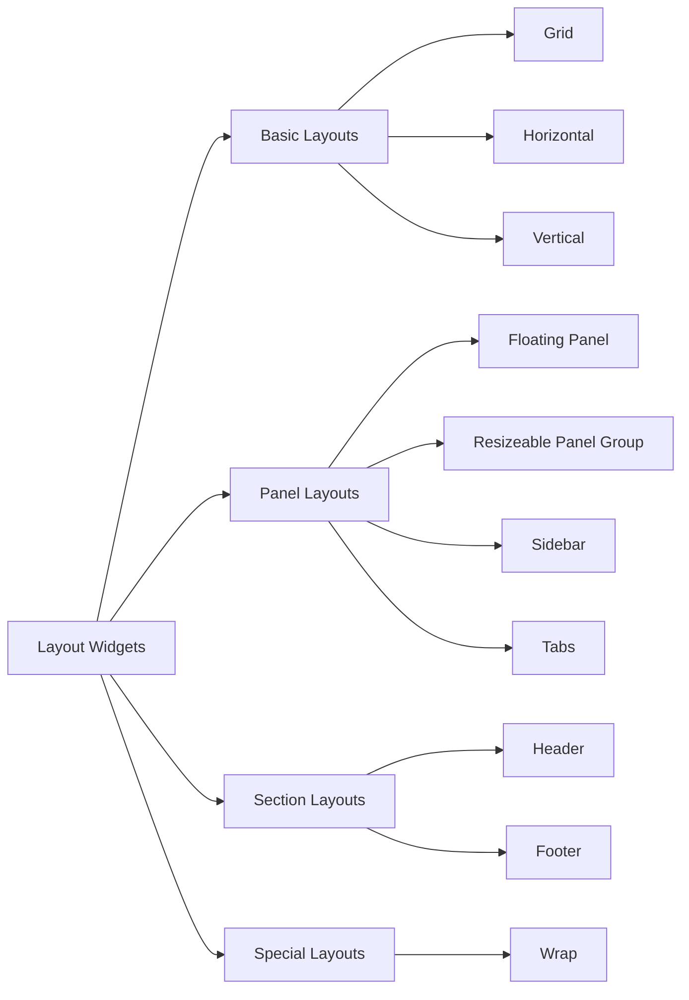
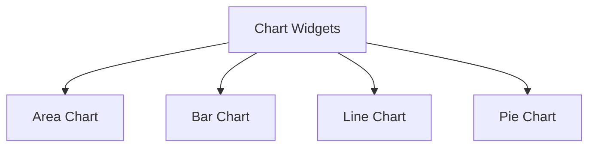

# Widgets

<Ingress>
Discover the fundamental building blocks of Ivy applications - Widgets provide declarative UI components inspired by React's component model.
</Ingress>

Widgets are the fundamental building blocks of the Ivy framework. They represent the smallest unit of UI and are used to construct Views. Inspired by React's component model, Widgets provide a declarative way to build user interfaces.

## Basic usage

Ivy provides a comprehensive set of widgets organized into several categories:

The most frequently used widgets for building user interfaces:

```csharp demo-below
Layout.Vertical().Gap(2)
    | new Badge("Primary")
    | new Badge("New")
    | new Button("Primary Button")
    | new Progress(75)
    | new Card("Card Content")
```

## Widget Categories

Ivy provides a comprehensive collection of common widgets designed to deliver the best experience for building interactive user interfaces. These widgets are organized into logical groups based on their usage patterns: common widgets, inputs, primitives, layouts, charts, and advanced components.



### Common Widgets

The common widgets category offers you the opportunity to work with essential UI elements including [badges](../../02_Widgets/01_Common/Badge.md), [blades](../../02_Widgets/01_Common/Blades.md), [buttons](../../02_Widgets/01_Common/Button.md), [cards](../../02_Widgets/01_Common/Card.md), [details implementations](../../02_Widgets/01_Common/Details.md), [dropdown menus](../../02_Widgets/01_Common/DropDownMenu.md), [expandable sections](../../02_Widgets/01_Common/Expandable.md), [lists](../../02_Widgets/01_Common/List.md), [progress bars](../../02_Widgets/01_Common/Progress.md), [tables](../../02_Widgets/01_Common/Table.md), and [tooltips](../../02_Widgets/01_Common/Tooltip.md). Each widget is designed with Ivy's signature approach to simplicity and functionality.



### Input Widgets

We also provide our users with various input methods to capture user data. Users can work with simple input types such as [boolean inputs](../../02_Widgets/02_Inputs/Bool.md), [feedback forms](../../02_Widgets/02_Inputs/Feedback.md), [text inputs](../../02_Widgets/02_Inputs/Text.md), [number inputs](../../02_Widgets/02_Inputs/Number.md), [date ranges](../../02_Widgets/02_Inputs/DateRange.md), and [date-time pickers](../../02_Widgets/02_Inputs/DateTime.md). Additionally, we offer specialized features including Ivy's [color palette](../../02_Widgets/02_Inputs/Color.md) system and our implementation of [code highlighting](../../02_Widgets/02_Inputs/Code.md). We introduce our [file input](../../02_Widgets/02_Inputs/File.md) implementations, [read-only](../../02_Widgets/02_Inputs/ReadOnly.md) statements, and provide the ability to work with complex structures like [async select](../../02_Widgets/02_Inputs/AsyncSelect.md) operations in a simple, intuitive way.



### Primitives

Ivy also provides a special experience when working with primitive widgets. We make complex tasks simpler through our implementation of [boxes](../../02_Widgets/03_Primitives/Box.md), [callouts](../../02_Widgets/03_Primitives/Callout.md), [error](../../02_Widgets/03_Primitives/Error.md) displays, and [text blocks](../../02_Widgets/03_Primitives/TextBlock.md). You can easily add [avatars](../../02_Widgets/03_Primitives/Avatar.md), [icons](../../02_Widgets/03_Primitives/Icon.md), [images](../../02_Widgets/03_Primitives/Image.md), [spacers](../../02_Widgets/03_Primitives/Spacer.md), and [separators](../../02_Widgets/03_Primitives/Separator.md) to enhance your interfaces. We also provide our own implementations of [JSON](../../02_Widgets/03_Primitives/Json.md), [XML](../../02_Widgets/03_Primitives/Xml.md), [HTML](../../02_Widgets/03_Primitives/Html.md), and [code rendering](../../02_Widgets/03_Primitives/Code.md) capabilities.



### Layouts

Ivy makes working with layouts not just easier, but satisfying. We provide a much more intuitive way to work with layouts and their elements, allowing you to create complex arrangements with minimal effort.



### Charts

Additionally, Ivy has its own implementation of charts, which makes data visualization much simpler to work with.



### Effects

Ivy provides a rich collection of built-in effects and animations to enhance your user interfaces. Working with effects in Ivy is incredibly simple and intuitive. For detailed information about specific effects, refer to the [animation](../../02_Widgets/05_Effects/Animation.md) and [confetti](../../02_Widgets/05_Effects/Confetti.md) documentation pages.

### Advanced

In the Advanced section, we introduce our specialized implementations for working with [sheets](../../02_Widgets/07_Advanced/Sheet.md) and [chat](../../02_Widgets/07_Advanced/Chat.md) functionality. These advanced widgets provide sophisticated features for complex user interface requirements.
