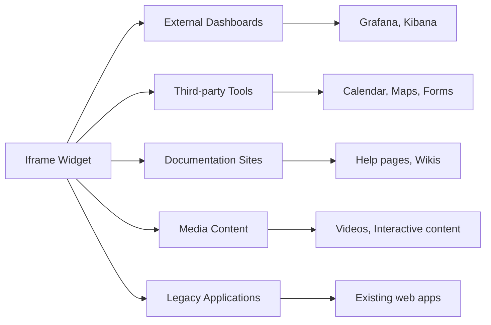
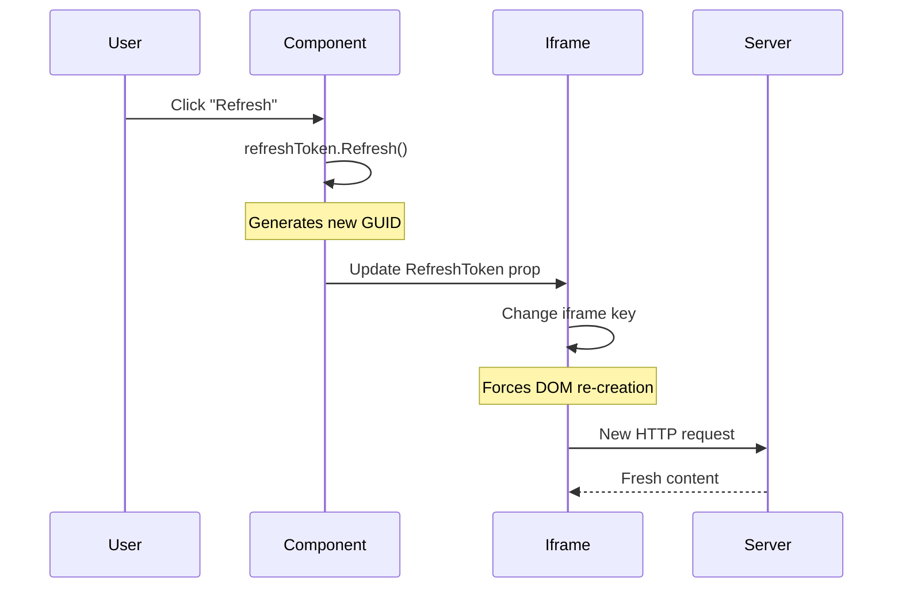

# Iframe

<Ingress>
Embed external web pages securely within your application using contained browsing contexts with proper security boundaries.
</Ingress>

The `Iframe` widget embeds external web pages into your app. It creates a contained browsing context that can display content from other websites while maintaining security boundaries.

## Use Cases



## Basic Usage

The simplest iframe displays external content:

```csharp demo-tabs
new Iframe("https://example.com")
```

## Common Patterns

### Conditional render of iframes

```csharp demo-tabs
public class ToolsDashboardView : ViewBase
{
    public override object? Build()
    {
        var selectedTool = UseState("docs");
        
        object GetSelectedTool() => selectedTool.Value switch
        {
            "docs" => new Iframe("https://docs.ivy.app/")
                .Width(Size.Full())
                .Height(Size.Units(150)),
            
            "samples" => new Iframe("https://samples.ivy.app")
                .Width(Size.Full())
                .Height(Size.Units(150)),
            
            "website" => new Iframe("https://ivy.app")
                .Width(Size.Full())
                .Height(Size.Units(150)),
                
            _ => Text.H3("Please select a tool")
        };
        
        return Layout.Vertical().Gap(4)
            | Text.P("Ivy Framework Pages")
            | (Layout.Horizontal().Gap(2)
                | new Button("Ivy Docs", onClick: _ => selectedTool.Set("docs"))
                | new Button("Ivy Samples", onClick: _ => selectedTool.Set("samples"))
                | new Button("Ivy Website", onClick: _ => selectedTool.Set("website")))
            | GetSelectedTool();
    }
}
```

### Refreshable Content

```csharp demo-tabs
public class RefreshableIframeView : ViewBase
{
    public override object? Build()
    {
        var refreshToken = this.UseRefreshToken();
        var url = UseState("https://httpbin.org/uuid");
        
        return Layout.Vertical().Gap(4)
            | Layout.Horizontal().Gap(2)
                | url.ToTextInput(placeholder: "Enter URL...")
                | new Button("Refresh", onClick: _ => refreshToken.Refresh())
                    .Icon(Icons.RotateCcw)
            | new Iframe(url.Value, refreshToken.Token.GetHashCode())
                .Width(Size.Full())
                .Height(Size.Units(120));
    }
}
```

### Responsive Iframe

```csharp demo-tabs
public class ResponsiveIframeView : ViewBase
{
    public override object? Build()
    {
        var aspectRatio = UseState("16:9");
        var url = UseState("https://www.youtube.com/embed/dQw4w9WgXcQ");
        
        const int baseWidth = 120;
        
        var height = aspectRatio.Value switch
        {
            "16:9" => Size.Units(baseWidth * 9 / 16),  // 67
            "4:3" => Size.Units(baseWidth * 3 / 4),   // 90
            "1:1" => Size.Units(baseWidth),           // 120
            _ => Size.Units(baseWidth * 9 / 16)       // Default to 16:9
        };
        
        return Layout.Vertical().Gap(4)
            | (Layout.Horizontal().Gap(2)
                | Text.Label("Aspect Ratio:")
                | new Button("16:9", onClick: _ => aspectRatio.Set("16:9"))
                | new Button("4:3", onClick: _ => aspectRatio.Set("4:3"))
                | new Button("1:1", onClick: _ => aspectRatio.Set("1:1")))
            | new Iframe(url.Value)
                .Width(Size.Units(baseWidth))
                .Height(height);
    }
}
```

## Refresh Token

The `RefreshToken` parameter forces the iframe to reload when changed:

```csharp
public class RefreshTokenExample : ViewBase
{
    public override object? Build()
    {
        var refreshToken = this.UseRefreshToken();
        
        return Layout.Vertical()
            | new Button("Reload Content", onClick: _ => refreshToken.Refresh())
            | new Iframe("https://example.com", refreshToken.Token.GetHashCode());
    }
}
```

### How Refresh Token Works



<WidgetDocs Type="Ivy.Iframe" ExtensionTypes="Ivy.IframeExtensions" SourceUrl="https://github.com/Ivy-Interactive/Ivy-Framework/blob/main/Ivy/Widgets/Primitives/Iframe.cs"/>
