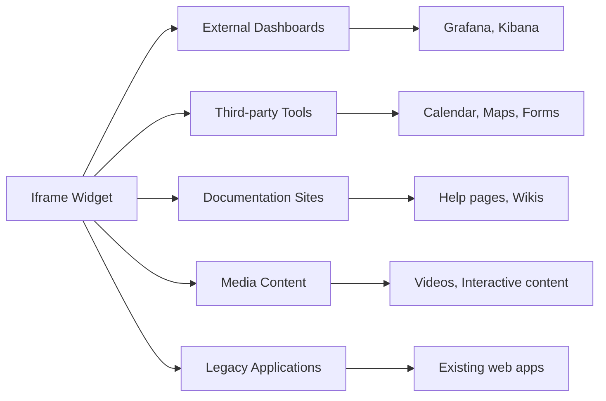
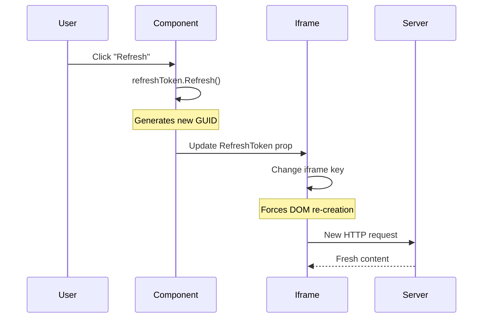
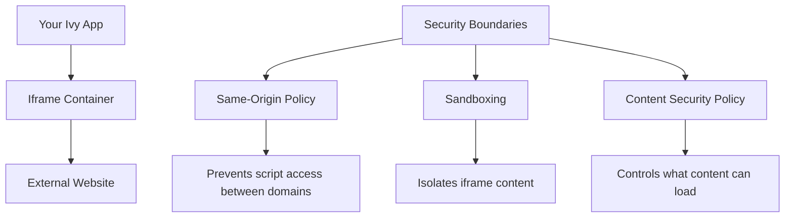

# Iframe

<Ingress>
Embed external web pages securely within your application using contained browsing contexts with proper security boundaries.
</Ingress>

The `Iframe` widget embeds external web pages into your app. It creates a contained browsing context that can display content from other websites while maintaining security boundaries.

## Use Cases



## Basic Usage

The simplest iframe displays external content:

```csharp demo-tabs
new Iframe("https://example.com")
```

## Common Patterns

### External Tools Dashboard

```csharp demo-tabs
public class ToolsDashboardView : ViewBase
{
    public override object? Build()
    {
        var selectedTool = UseState("dashboard");
        
        object GetSelectedTool() => selectedTool.Value switch
        {
            "dashboard" => new Iframe("https://grafana.com/grafana/dashboards/1860-node-exporter-full/")
                .Width(Size.Full())
                .Height(Size.Units(150)),
            
            "weather" => new Iframe("https://weather.com/?Goto=Redirected")
                .Width(Size.Full())
                .Height(Size.Units(150)),
            
            "calendar" => new Iframe("https://calendar.google.com/calendar/embed")
                .Width(Size.Full())
                .Height(Size.Units(150)),
                
            _ => Text.H3("Please select a tool")
        };
        
        return Layout.Vertical().Gap(4)
            | Text.H1("External Tools Dashboard")
            | (Layout.Horizontal().Gap(2)
                | new Button("Metrics Dashboard", onClick: _ => selectedTool.Set("dashboard"))
                | new Button("Weather", onClick: _ => selectedTool.Set("weather"))
                | new Button("Calendar", onClick: _ => selectedTool.Set("calendar")))
            | GetSelectedTool();
    }
}
```

### Documentation Viewer

```csharp demo-tabs
public class DocumentationView : ViewBase
{
    public override object? Build()
    {
        var currentDoc = UseState("getting-started");
        
        var docUrls = new Dictionary<string, string>
        {
            ["getting-started"] = "https://docs.example.com/getting-started",
            ["api-reference"] = "https://docs.example.com/api",
            ["tutorials"] = "https://docs.example.com/tutorials"
        };
        
        return Layout.Horizontal().Gap(4)
            | Layout.Vertical().Width(Size.Units(60))
                | Text.H3("Documentation")
                | Layout.Vertical().Gap(2)
                    | new Button("Getting Started", onClick: _ => currentDoc.Set("getting-started"))
                    | new Button("API Reference", onClick: _ => currentDoc.Set("api-reference"))
                    | new Button("Tutorials", onClick: _ => currentDoc.Set("tutorials"))
            | new Iframe(docUrls[currentDoc.Value])
                .Width(Size.Grow())
                .Height(Size.Units(200));
    }
}
```

### Refreshable Content

```csharp demo-tabs
public class RefreshableIframeView : ViewBase
{
    public override object? Build()
    {
        var refreshToken = this.UseRefreshToken();
        var url = UseState("https://httpbin.org/uuid");
        
        return Layout.Vertical().Gap(4)
            | Layout.Horizontal().Gap(2)
                | url.ToTextInput(placeholder: "Enter URL...")
                | new Button("Refresh", onClick: _ => refreshToken.Refresh())
                    .Icon(Icons.RotateCcw)
            | new Iframe(url.Value, refreshToken.Token.GetHashCode())
                .Width(Size.Full())
                .Height(Size.Units(120));
    }
}
```

### Responsive Iframe

```csharp demo-tabs
public class ResponsiveIframeView : ViewBase
{
    public override object? Build()
    {
        var aspectRatio = UseState("16:9");
        var url = UseState("https://www.youtube.com/embed/dQw4w9WgXcQ");
        
        var height = aspectRatio.Value switch
        {
            "16:9" => Size.Units(135), // 240 * 9/16
            "4:3" => Size.Units(180),  // 240 * 3/4
            "1:1" => Size.Units(240),
            _ => Size.Units(135)
        };
        
        return Layout.Vertical().Gap(4)
            | Layout.Horizontal().Gap(2)
                | Text.Label("Aspect Ratio:")
                | new Button("16:9", onClick: _ => aspectRatio.Set("16:9"))
                | new Button("4:3", onClick: _ => aspectRatio.Set("4:3"))
                | new Button("1:1", onClick: _ => aspectRatio.Set("1:1"))
            | new Iframe(url.Value)
                .Width(Size.Units(240))
                .Height(height);
    }
}
```

## Refresh Token

The `RefreshToken` parameter forces the iframe to reload when changed:

```csharp
public class RefreshTokenExample : ViewBase
{
    public override object? Build()
    {
        var refreshToken = this.UseRefreshToken();
        
        return Layout.Vertical()
            | new Button("Reload Content", onClick: _ => refreshToken.Refresh())
            | new Iframe("https://example.com", refreshToken.Token.GetHashCode());
    }
}
```

### How Refresh Token Works



## Sizing and Layout

### Fixed Dimensions

```csharp
new Iframe("https://example.com")
    .Width(Size.Units(80))
    .Height(Size.Units(60))
```

### Responsive Sizing

```csharp
new Iframe("https://example.com")
    .Width(Size.Full())
    .Height(Size.ViewportHeight(80)) // 80% of viewport height
```

### Container-based Sizing

```csharp
Layout.Vertical().Height(Size.Units(200))
    | new Iframe("https://example.com")
        .Width(Size.Full())
        .Height(Size.Full()) // Fill parent container
```

## Security Considerations

### Browser Security Model

Iframes provide natural security boundaries through the browser's same-origin policy:



### Trusted Sources Only

```csharp
public class SecureIframeView : ViewBase
{
    private readonly string[] _trustedDomains = 
    [
        "https://docs.company.com",
        "https://dashboard.company.com",
        "https://calendar.google.com"
    ];
    
    public override object? Build()
    {
        var url = UseState("");
        var isValidUrl = _trustedDomains.Any(domain => url.Value.StartsWith(domain));
        
        return Layout.Vertical().Gap(4)
            | url.ToTextInput(placeholder: "Enter trusted URL...")
            | (isValidUrl 
                ? new Iframe(url.Value).Width(Size.Full()).Height(Size.Units(120))
                : Text.Danger("URL not in trusted domains list"))
            | Text.Small($"Trusted domains: {string.Join(", ", _trustedDomains)}");
    }
}
```

### Content Security Policy

When hosting your Ivy app, configure CSP headers to control iframe sources:

```http
Content-Security-Policy: frame-src 'self' https://trusted-domain.com https://*.company.com;
```

## Best Practices

### 1. Always Set Dimensions

```csharp
// Good: Explicit dimensions
new Iframe("https://example.com")
    .Width(Size.Full())
    .Height(Size.Units(120))

// Avoid: No dimensions (may cause layout issues)
new Iframe("https://example.com")
```

### 2. Handle Loading States

```csharp
public class LoadingIframeView : ViewBase
{
    public override object? Build()
    {
        var isLoading = UseState(true);
        var url = "https://example.com";
        
        return Layout.Stack()
            | (isLoading.Value ? new Loading() : null)
            | new Iframe(url)
                .Width(Size.Full())
                .Height(Size.Units(120))
                .OnLoad(_ => isLoading.Set(false)); // Note: OnLoad may not be available
    }
}
```

### 3. Provide Fallback Content

```csharp
public class FallbackIframeView : ViewBase
{
    public override object? Build()
    {
        var showFallback = UseState(false);
        var url = "https://example.com";
        
        return showFallback.Value
            ? Layout.Vertical().Gap(2)
                | Text.Muted("Content unavailable")
                | new Button("Try Again", onClick: _ => showFallback.Set(false))
            : new Iframe(url).Width(Size.Full()).Height(Size.Units(120));
    }
}
```

### 4. Use Refresh Tokens for Dynamic Content

```csharp
public class DynamicContentView : ViewBase
{
    public override object? Build()
    {
        var refreshToken = this.UseRefreshToken();
        var lastRefresh = UseState(DateTime.Now);
        
        // Auto-refresh every 5 minutes
        UseEffect(async () =>
        {
            while (true)
            {
                await Task.Delay(TimeSpan.FromMinutes(5));
                refreshToken.Refresh();
                lastRefresh.Set(DateTime.Now);
            }
        });
        
        return Layout.Vertical().Gap(2)
            | Text.Small($"Last refreshed: {lastRefresh.Value:HH:mm:ss}")
            | new Iframe("https://api.example.com/dashboard", refreshToken.Token.GetHashCode())
                .Width(Size.Full())
                .Height(Size.Units(120));
    }
}
```

## Common Issues and Solutions

### Issue: Iframe Not Loading

**Possible Causes:**
- X-Frame-Options header blocking embedding
- Content Security Policy restrictions
- HTTPS/HTTP mixed content issues

**Solutions:**
```csharp
public class DiagnosticIframeView : ViewBase
{
    public override object? Build()
    {
        var url = UseState("https://example.com");
        var hasError = UseState(false);
        
        return Layout.Vertical().Gap(4)
            | url.ToTextInput(placeholder: "Test URL...")
            | (hasError.Value 
                ? Layout.Vertical().Gap(2)
                    | Text.Danger("Failed to load content")
                    | Text.Small("Check browser console for X-Frame-Options or CSP errors")
                    | new Button("Retry", onClick: _ => hasError.Set(false))
                : new Iframe(url.Value).Width(Size.Full()).Height(Size.Units(120)));
    }
}
```

### Issue: Content Not Refreshing

**Solution: Use RefreshToken**
```csharp
// Force refresh by changing the token
var refreshToken = this.UseRefreshToken();
refreshToken.Refresh(); // Triggers iframe reload
```

### Issue: Responsive Layout Problems

**Solution: Container-based Sizing**
```csharp
// Wrap in a sized container
Layout.Vertical().Height(Size.Units(200))
    | new Iframe(url).Width(Size.Full()).Height(Size.Full())
```

## When to Use Iframe

**Use Iframe when:**
- Embedding external dashboards or tools
- Displaying third-party content you don't control
- Integrating legacy web applications
- Showing documentation or help pages
- Embedding interactive content (maps, videos, forms)

**Don't use Iframe when:**
- You need tight integration with the parent app
- The external site blocks iframe embedding
- You need to access the iframe's content via JavaScript
- Simple content display would suffice (use Html widget)
- Performance is critical (iframes add overhead)

## Performance Considerations

### Lazy Loading

```csharp
public class LazyIframeView : ViewBase
{
    public override object? Build()
    {
        var shouldLoad = UseState(false);
        var url = "https://heavy-content.example.com";
        
        return shouldLoad.Value
            ? new Iframe(url).Width(Size.Full()).Height(Size.Units(120))
            : Layout.Vertical().Gap(2)
                | Text.P("Heavy content available")
                | new Button("Load Content", onClick: _ => shouldLoad.Set(true));
    }
}
```

### Memory Management

```csharp
public class ManagedIframeView : ViewBase
{
    public override object? Build()
    {
        var activeTab = UseState("tab1");
        
        // Only render active iframe to save memory
        return Layout.Vertical().Gap(4)
            | Layout.Horizontal().Gap(2)
                | new Button("Tab 1", onClick: _ => activeTab.Set("tab1"))
                | new Button("Tab 2", onClick: _ => activeTab.Set("tab2"))
            | (activeTab.Value switch
            {
                "tab1" => new Iframe("https://example1.com"),
                "tab2" => new Iframe("https://example2.com"),
                _ => Text.P("Select a tab")
            }).Width(Size.Full()).Height(Size.Units(120));
    }
}
```

<WidgetDocs Type="Ivy.Iframe" ExtensionTypes="Ivy.IframeExtensions" SourceUrl="https://github.com/Ivy-Interactive/Ivy-Framework/blob/main/Ivy/Widgets/Primitives/Iframe.cs"/>
